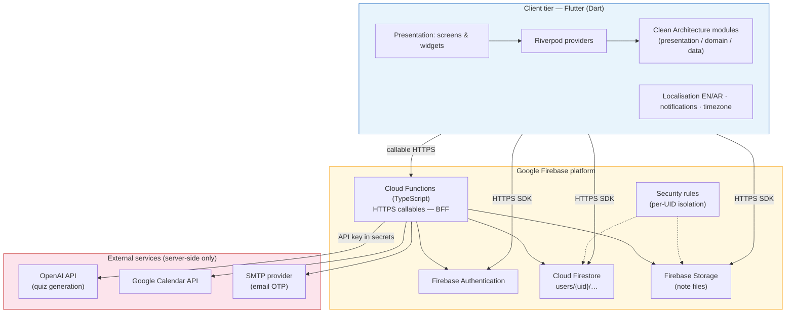
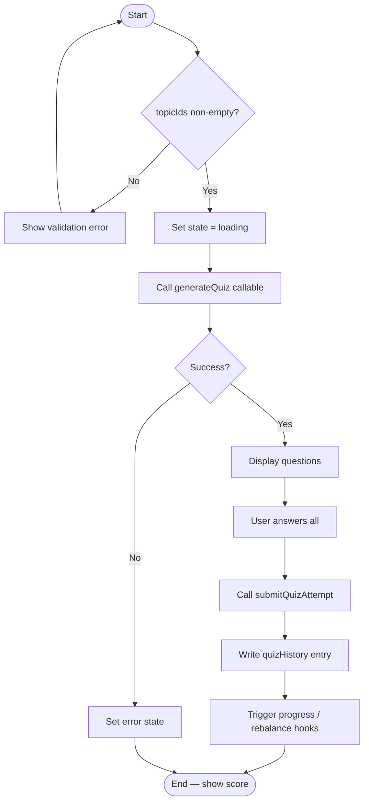
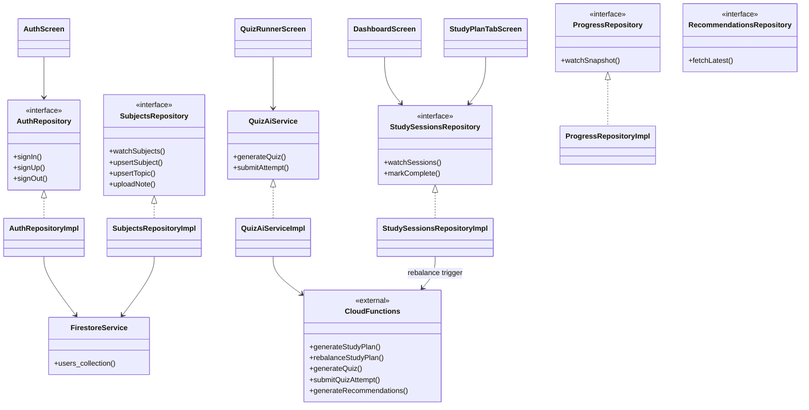
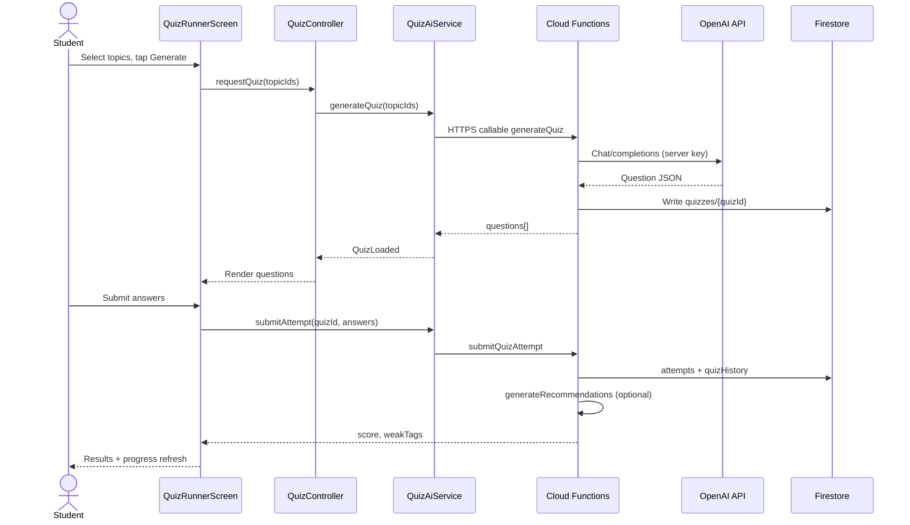
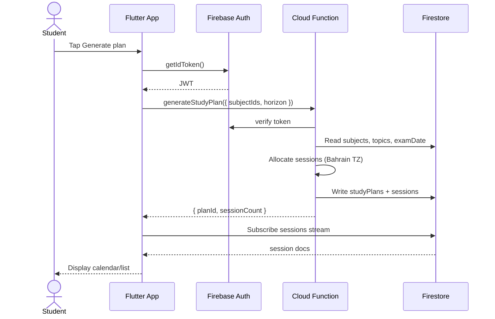
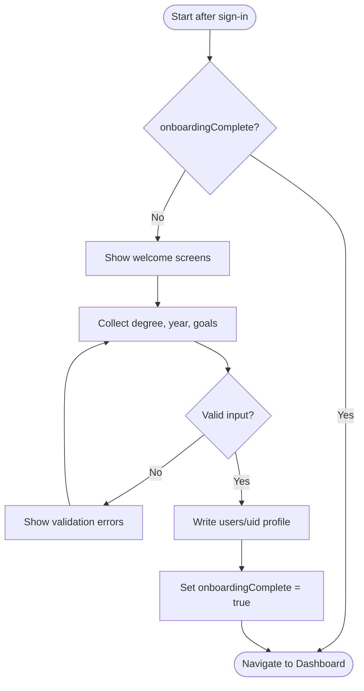
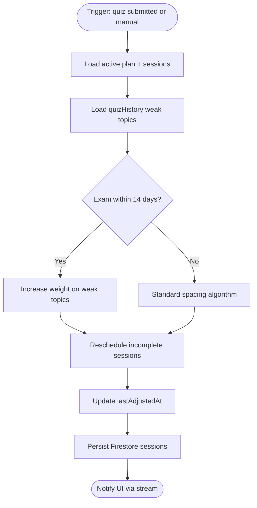
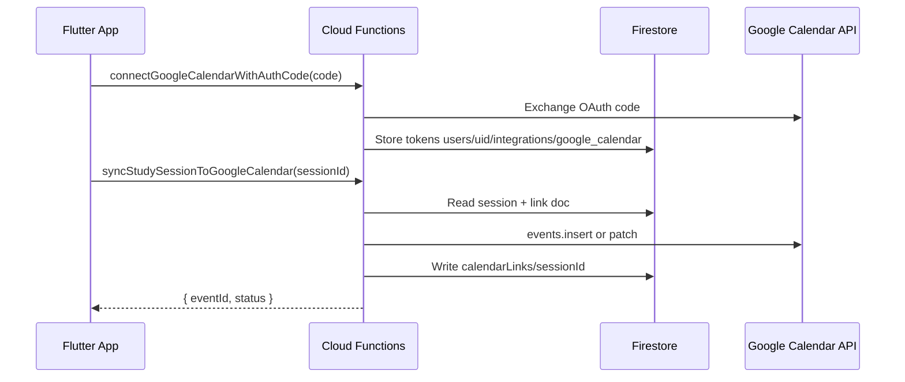

---

## Introductory contents (5%) {#introductory-contents-5}

The following sections satisfy the Bahrain Polytechnic (BP) project thesis template for introductory material: cover page, title page, copyright rights and waiver, declaration, abstract, and acknowledgements.

---

## Cover Page {#cover-page}

*A cover page according to Bahrain Polytechnic requirements must be included. Replace bracketed placeholders and insert the official BP logo when exporting to Word/PDF.*

<div align="center">

<br><br><br>

**[Insert Bahrain Polytechnic logo]**

<br><br>

# BAHRAIN POLYTECHNIC

## School of Information and Communications Technology

<br><br><br>

# PILLAR (STUDY COACH)

## Cross-Platform AI Study Companion for University Students

<br><br>

### Final Year Project / Thesis Report

<br><br><br>

**[Student Full Name]**

<br><br>

**[Academic Year, e.g. 2025–2026]**

</div>

---

## Title Page {#title-page}

*A title page according to Bahrain Polytechnic requirements must be included.*

<div align="center">

# PILLAR (STUDY COACH)

## Cross-Platform AI Study Companion for University Students

<br><br>

A project thesis submitted in partial fulfilment of the requirements for the award of

**[Degree Name, e.g. Bachelor of Science in Information and Communications Technology]**

<br><br>

at

# Bahrain Polytechnic

<br><br>

**Submitted by:** [Student Full Name]  
**Student ID:** [Student ID Number]  
**Programme:** [Programme Name]  
**School:** School of Information and Communications Technology  

<br><br>

**Supervisor:** [Supervisor Name]  

**Date of submission:** [DD Month YYYY]  

</div>

---

## Copyright Rights & Waiver {#copyright-waiver}

It is good practice to copyright your work. Any copyrighted materials used in your work may be used only with the **written permission of the copyright owner**. Where third-party figures, software screenshots, or excerpts are included, permission or licence terms must be documented and cited in the main text.

I hereby assign to **Bahrain Polytechnic** the full copyright for this thesis report entitled **“Pillar (Study Coach): Cross-Platform AI Study Companion for University Students”**, submitted in partial fulfilment of the requirements for the award of **[Degree/Programme Name]** at Bahrain Polytechnic.

I understand that the institution may make this work available in print or electronic form for educational and archival purposes, subject to applicable institutional policies.

<br>

**Student name:** _________________________________  

**Signature:** _________________________________  

**Date:** _________________________________  

---

## Declaration {#declaration}

I hereby declare that this submission is my own work and that, to the best of my knowledge and belief, it contains no material previously published or written by another person nor material which to a substantial extent has been accepted for the award of any other degree or diploma of the university or other institute of higher learning, except where due acknowledgment has been made in the text.

I further confirm that the software artefact described (**Pillar**) was developed as part of this project and that the testing results presented are reported accurately to the best of my knowledge.

<br>

**Name:** _________________________________  

**Signature:** _________________________________  

**Date:** _________________________________  

---

## Abstract {#abstract}

**Purpose.** This thesis presents **Pillar**, a cross-platform learning support application for iOS, Android, and web, designed to help university students improve study consistency, engagement, and self-management. The project addresses fragmented study behaviour by integrating deadline-aware planning, artificial intelligence (AI)-supported practice, and measurable progress feedback in one student-centred system.

**Methodology.** A user-centred software engineering methodology was applied: requirements analysis, solution design, iterative implementation, and structured evaluation. The system was built with Flutter, Riverpod, and Firebase (Authentication, Firestore, Storage, Cloud Functions) using Clean Architecture. Core capabilities include onboarding, subjects and exam deadlines, adaptive study plans, AI quizzes, progress insights, recommendations, reminders, and English/Arabic localisation.

**Results.** Functional and acceptance testing confirmed reliable end-to-end workflows. A pilot evaluation with sixteen students reported 93.8% task completion, a mean System Usability Scale (SUS) score of 81.6, and favourable satisfaction ratings. The minimum viable product demonstrates a practical setup–plan–practice–measure–adjust study loop.

**Conclusions.** Pillar shows that planning, AI-supported practice, and progress analytics can be delivered coherently on one platform. The project contributes a relevant educational technology artefact and establishes a foundation for deeper personalisation, expanded languages, and longitudinal impact studies.

*Word count: approximately 210 (maximum 300 words per BP guidelines).*

---

## Acknowledgements {#acknowledgements}

You should add acknowledgements to any person you believe gave you support on this project (family, friends, supervisor, manager, clients, and others).

I would like to express my sincere gratitude to **[Supervisor Name]**, my project supervisor, for their guidance, feedback, and support throughout the development and documentation of Pillar.

I am thankful to the **pilot participants** who took part in usability and acceptance testing, and to **Bahrain Polytechnic** faculty and staff who provided resources, facilities, and academic direction during this project.

I also acknowledge **family and friends** for their encouragement and patience during the completion of this work, and my **peers** for informal review sessions that helped refine requirements and interface design.

<br>

**[Student Full Name]**  
**[Month YYYY]**

---

## Listings (5%) {#listings-5}

This section contains the five required listings for the Bahrain Polytechnic project thesis template: table of contents, list of figures, list of tables, list of symbols, and list of abbreviations.

When exporting to Microsoft Word, use **References → Table of Contents**, **Insert Table of Figures**, and **Insert Table of Tables** to insert page numbers automatically. The markdown version below uses hyperlinks for digital navigation; replace `[page]` placeholders with printed page numbers in the bound copy.

---

## Table of Contents {#table-of-contents}

A table of all contents (sections) is included below.

- [Introductory contents (5%)](#introductory-contents-5)
- [Cover Page](#cover-page)
- [Title Page](#title-page)
- [Copyright Rights & Waiver](#copyright-waiver)
- [Declaration](#declaration)
- [Abstract](#abstract)
- [Acknowledgements](#acknowledgements)
- [Listings (5%)](#listings-5)
  - [Table of Contents](#table-of-contents)
  - [List of Figures](#list-of-figures)
  - [List of Tables](#list-of-tables)
  - [List of Symbols](#list-of-symbols)
  - [List of Abbreviations](#list-of-abbreviations)
- [1. Introduction (5%)](#1-introduction-5)
  - [1.1 Project Rationale](#11-project-rationale)
  - [1.2 Project Objectives](#12-project-objectives)
  - [1.3 Proposed Solution](#13-proposed-solution)
  - [1.4 Description of the Report](#14-description-of-the-report)
- [2. Background Work (20%)](#2-background-work-20)
  - [2.1 Related Theory](#21-related-theory)
  - [2.2 Project Technology](#22-project-technology)
  - [2.3 Related Work](#23-related-work)
  - [2.4 Market Research](#24-market-research)
- [3. Methodology](#3-methodology)
  - [3.1 Requirements (10%)](#31-requirements-10)
    - [Requirements Elicitation](#requirements-elicitation)
    - [Functional Requirements](#functional-requirements)
    - [Non-Functional Requirements](#non-functional-requirements)
    - [Constraints](#constraints)
  - [3.2 Solution Design (10%)](#32-solution-design-10)
    - [Design Methodology](#design-methodology)
    - [Data Structures](#data-structures)
    - [Design Diagrams](#design-diagrams)
    - [Algorithms (flowcharts and pseudocode)](#algorithms-flowcharts-and-pseudocode)
    - [System Architecture](#system-architecture)
  - [3.3 Implementation (10%)](#33-implementation-10)
    - [Significant implementation steps](#significant-implementation-steps)
    - [System and development platform setup](#system-and-development-platform-setup)
    - [Tools, libraries, and coding](#tools-libraries-and-coding)
    - [Description by components (including visuals)](#description-by-components-including-visuals)
  - [3.4 Testing (10%)](#34-testing-10)
    - [Test Plan](#test-plan)
    - [Participants](#participants)
    - [Functionality test cases and results](#functionality-test-cases-and-results)
    - [Acceptance tests process and results](#acceptance-tests-process-and-results)
    - [Usability testing results and statistics](#usability-testing-results-and-statistics)
    - [Critical analysis of testing](#critical-analysis-of-testing)
- [4. Discussion and Conclusion (20%)](#4-discussion-and-conclusion-20)
  - [System Functionality](#system-functionality)
  - [Summary of Achieved Objectives](#summary-of-achieved-objectives)
  - [Project Issues (with Proposed Solutions/Actions)](#project-issues-with-proposed-solutionsactions)
  - [Legal, Ethical, Social, and Professional Issues](#legal-ethical-social-and-professional-issues)
  - [Future Work (Upgrades – Modifications)](#future-work-upgrades--modifications)
  - [Synopsis of Your Experience](#synopsis-of-your-experience)
  - [Conclusion](#conclusion)
- [References (5%)](#references-5)
- [Appendices](#appendices)
  - [Appendix I: Survey Analysis & Interviews Summary](#appendix-i-survey-analysis--interviews-summary)
  - [Appendix II: Design Diagrams](#appendix-ii-design-diagrams)
  - [Appendix III: Source Code / Configuration Files](#appendix-iii-source-code--configuration-files)
  - [Appendix IV: Testing Results](#appendix-iv-testing-results)
  - [Appendix V: User Manual & Training Manuals](#appendix-v-user-manual--training-manuals)

*[Page numbers: insert in Word/PDF export.]*

---

## List of Figures {#list-of-figures}

A list of all figures (images, graphs, diagrams, and other visuals) is included below, in a format similar to the table of contents.

| Figure | Title | Page |
|---|---|---|
| [Figure 2.1](#figure-21) | High-level technology stack and deployment topology | [ ] |
| [Figure 3.1](#figure-31) | Authentication screen and validation state | [ ] |
| [Figure 3.2](#figure-32) | Onboarding flow screens | [ ] |
| [Figure 3.3](#figure-33) | Subjects management and exam-deadline setup | [ ] |
| [Figure 3.4](#figure-34) | Roadmap and study-plan session flow | [ ] |
| [Figure 3.5](#figure-35) | Quiz generation and quiz runner interaction | [ ] |
| [Figure 3.6](#figure-36) | Progress insights and weak-area indicators | [ ] |
| [Figure 3.7](#figure-37) | Dashboard inbox and reminders settings | [ ] |
| [Figure 3.8](#figure-38) | Focus session and academic tasks | [ ] |
| [Figure 3.9](#figure-39) | Dashboard and profile personalization | [ ] |
| [Figure 3.10](#figure-310) | System architecture / deployment diagram | [ ] |
| [Figure B.1](#figure-b1) | Extended UML class diagram (Appendix II) | [ ] |
| [Figure B.2](#figure-b2) | UML sequence diagram — AI quiz flow (Appendix II) | [ ] |
| [Figure B.2b](#figure-b2b) | UML sequence diagram — study plan generation (Appendix II) | [ ] |
| [Figure B.3](#figure-b3) | UML activity diagram — onboarding (Appendix II) | [ ] |
| [Figure B.4](#figure-b4) | Flowchart — plan rebalancing (Appendix II) | [ ] |
| [Figure B.5](#figure-b5) | Sequence — Google Calendar sync (Appendix II) | [ ] |
| [Figure B.6](#figure-b6) | Logical components mapped to functional requirements (Appendix II) | [ ] |
| [Figure D.1](#figure-d1) | Usability task completion chart (Appendix IV) | [ ] |
| [Figure D.2](#figure-d2) | SUS score distribution (Appendix IV) | [ ] |

---

## List of Tables {#list-of-tables}

A list of all tables (statistics and other tabular information) is included below, in a format similar to the table of contents.

| Table | Title | Page |
|---|---|---|
| [Table 2.1](#table-21) | Comparative analysis of existing solutions | [ ] |
| [Table 2.2](#table-22) | Project technology coverage and justification summary | [ ] |
| [Table 3.1](#table-31) | User requirements catalogue | [ ] |
| [Table 3.2](#table-32) | Prioritized requirements (MoSCoW) | [ ] |
| [Table 3.3](#table-33) | Functionality test matrix (FT-01–FT-26) | [ ] |
| [Table 3.4](#table-34) | Acceptance test results | [ ] |
| [Table 3.5](#table-35) | Usability results (n = 16) | [ ] |
| [Table 3.6](#table-36) | Requirements-to-design traceability | [ ] |
| [Table 3.7](#table-37) | Data structure selection rationale | [ ] |
| [Table 3.8](#table-38) | Algorithm design and evaluation steps | [ ] |
| [Table 3.9](#table-39) | Implementation phases and FR delivery | [ ] |
| [Table 3.10](#table-310-setup) | Replicable environment setup steps | [ ] |
| [Table 3.11](#table-311) | Requirements-to-test coverage (FR → FT/AT) | [ ] |
| [Table 4.1](#table-41) | Project issues, actions taken, and next steps | [ ] |
| [Table 4.2](#table-42) | SMART objectives — achievement summary | [ ] |
| [Table D.1](#table-d1) | Participant profile summary (Appendix IV) | [ ] |
| [Table D.2](#table-d2) | Aggregated task timing (Appendix IV) | [ ] |
| [Table D.3](#table-d3) | Functionality test pass rates (Appendix IV) | [ ] |
| [Table D.4](#table-d4) | Acceptance test sign-off (Appendix IV) | [ ] |

---

## List of Symbols {#list-of-symbols}

A list of all symbols used in this document is given below with a clear description for the reader’s reference.

| Symbol | Description |
|---|---|
| ∞ | Infinity symbol (unbounded upper bound in theoretical discussion, if used) |
| → | Flow direction (process step or data flow, e.g. authenticate → onboard) |
| ↔ | Bidirectional communication or interaction (e.g. FR5 ↔ FR9) |
| ∑ | Summation (aggregate metrics) |
| μ | Population or sample mean (e.g. mean participant age in §3.4, Participants) |
| σ | Standard deviation (e.g. age distribution in §3.4, Participants) |
| n | Sample size (number of participants, e.g. n = 16) |
| % | Percentage |
| / | Per (e.g. errors per task) |
| ≥ | Greater than or equal to (e.g. SUS ≥ 70) |
| ≤ | Less than or equal to (e.g. response time ≤ 2 s) |
| ∅ | Empty set / no input |

---

## List of Abbreviations {#list-of-abbreviations}

A list of all abbreviations used in this document is given below. Each abbreviation is placed next to the exact phrase it represents (as required by the BP template). For example, **BP** is used in this document and is listed with the phrase **Bahrain Polytechnic**.

| Abbreviation | Exact phrase represented |
|---|---|
| AI | Artificial Intelligence |
| API | Application Programming Interface |
| AR | Arabic (user interface language option) |
| AT | Acceptance Test |
| BP | Bahrain Polytechnic |
| BFF | Backend-for-Frontend |
| CF | Cloud Functions |
| EN | English (user interface language option) |
| FR | Functional Requirement |
| FT | Functionality Test |
| HTTPS | Hypertext Transfer Protocol Secure |
| ICT | Information and Communication Technology |
| ISO-8601 | International date and time format standard |
| ITS | Intelligent Tutoring System |
| JSON | JavaScript Object Notation |
| LESPI | Legal, Ethical, Social, and Professional Issues |
| LLM | Large Language Model |
| MIS | Management Information Systems |
| ML | Machine Learning |
| MoSCoW | Must, Should, Could, Won't (prioritisation method) |
| MVP | Minimum Viable Product |
| NFR | Non-Functional Requirement |
| OTP | One-Time Password |
| REST | Representational State Transfer |
| SDK | Software Development Kit |
| SRL | Self-Regulated Learning |
| SMTP | Simple Mail Transfer Protocol |
| SUS | System Usability Scale |
| UI | User Interface |
| UID | User identifier |
| UML | Unified Modeling Language |
| UR | User Requirement |
| UX | User Experience |

---

## 1. Introduction (5%) {#1-introduction-5}

This is a general introduction to what this report is about—not merely a list of section titles. **Pillar** (Study Coach) is a cross-platform, artificial intelligence (AI)-supported study companion for university students, developed at **Bahrain Polytechnic** as a final-year software engineering project.

**The problem** is fragmented study behaviour: learners juggle separate tools for planning, revision, and help-seeking, which weakens organisation and self-regulated learning as exams approach. **Why it is worthwhile:** integrating planning, AI-supported practice, and measurable feedback in one student-centred system can reduce cognitive load and support sustainable study habits—a gap confirmed by market comparison (§2.4) and pilot evaluation.

**Proposed approach:** user-centred requirements engineering, solution design (data models, UML, algorithms), iterative implementation with Flutter and Firebase, and structured testing (functionality, acceptance, and usability).

**Main results:** a working minimum viable product (MVP) covering the study loop **setup → plan → practice → measure → adjust**; **26/26** functionality tests passed; **10/10** acceptance scenarios passed; pilot with **n = 16** reported **93.8%** task completion and mean **System Usability Scale (SUS)** score **81.6**.

The remainder of this chapter presents **project rationale** (§1.1), **objectives** (§1.2), the **proposed solution** refined since the project charter (§1.3), and a **description of the report** structure (§1.4).

### 1.1 Project Rationale

#### Domain

The project domain is **educational technology (EdTech)** for **higher education**, specifically **self-regulated learning (SRL)** support for **university students**. Students must organise work across subjects, prioritise revision before exam deadlines, practise to test understanding, and adjust strategy when performance is weak. The domain intersects mobile learning, learning analytics, and secure cloud-backed AI services.

#### The problem

University students increasingly manage complex workloads across multiple subjects, deadlines, and assessment periods. In practice, many experience **fragmented study behaviour**: inconsistent planning, poor visibility of priorities, and frequent switching between calendars, note apps, flashcard tools, and generic AI chat. This fragmentation increases **cognitive load** (Sweller, 1988) and reduces sustained, self-regulated study (Zimmerman, 2002).

#### Significance and motivation

The problem matters for three reasons:

1. **Academic outcomes** — Weak organisation and irregular revision are associated with poorer performance and higher stress during assessment periods.
2. **Tool mismatch** — Generic productivity apps rarely model academic structures (subjects, topics, exam timelines).
3. **Disconnected AI** — Standalone AI tools can answer questions but often lack continuity with a student’s plan, quiz history, and weak areas over time.

**Motivation:** design an integrated, student-centred system that supports the full study cycle within one cross-platform experience. This aligns with Bahrain Polytechnic goals: applied software engineering, digital literacy, and learner-centred innovation. The project also contributes a research and teaching artefact that demonstrates how planning, practice, and analytics can be delivered coherently on one platform.

### 1.2 Project Objectives

Describe what the project expects to achieve. Objectives include **technical** delivery targets and **general** educational, research, and product goals. All objectives use the **SMART** framework (Specific, Measurable, Achievable, Relevant, Time-bound).

#### Technical objectives

| ID | Objective (Specific) | Measurable | Achievable | Relevant | Time-bound |
|---|---|---|---|---|---|
| T1 | Deliver a cross-platform Pillar app (iOS, Android, web) with core study modules | Must-level FRs (FR1–FR5, FR9, FR14) implemented; FT-01–FT-14 and AT-01–AT-06 test evidence | Uses Flutter/Firebase within project scope and skills | Directly solves fragmented workflow problem | Completed within final-year project period |
| T2 | Implement secure authentication, onboarding, and profile continuity | Sign-in, onboarding, and persistence scenarios pass acceptance tests | Supported by Firebase Auth and local state patterns | Required for personalised study support | Delivered in MVP release |
| T3 | Provide subjects, roadmap, and adaptive study planning | Subjects/exam setup and plan generation/rebalancing functional | Server callables (`generateStudyPlan`, `rebalanceStudyPlan`) | Core planning objective | Delivered in MVP release |
| T4 | Integrate AI quiz generation and progress recommendations | Quiz flow and insights operational; attempts stored in Firestore | OpenAI invoked via Cloud Functions (keys not in client) | Supports practice and feedback loop | Delivered in MVP release |
| T5 | Achieve acceptable usability and reliability | Pilot: 93.8% task completion; SUS 81.6; core defects resolved | Scope limited to defined MVP workflows | Validates real student use | Evaluated in testing phase |

#### General objectives

| ID | Objective (Specific) | Measurable | Achievable | Relevant | Time-bound |
|---|---|---|---|---|---|
| G1 | Improve students’ ability to organise study around deadlines | Task-based pilot completion; planning features used in scenarios | Matches typical student needs at Bahrain Polytechnic | Addresses academic organisation problem | Assessed during usability pilot |
| G2 | Support motivation through guided practice and feedback | Quiz + progress + recommendation workflow in one app | Builds on implemented MVP features | Links engagement to measurable progress | Assessed during usability pilot |
| G3 | Demonstrate value of combining planning and AI in one product | Comparative analysis (Table 2.1) and integrated user journey | Differentiates from single-purpose tools | Supports project justification | Documented in Background Work |
| G4 | Produce an extensible foundation for future educational features | Clean Architecture, modular features, documented future work | Avoids over-scoping beyond MVP | Enables continued research/development | Documented in Future Work |

### 1.3 Proposed Solution

Give an overview of the proposed approach, refined compared with the **initial project charter** as development progressed.

**Pillar** is an integrated cross-platform application (iOS, Android, web) that implements the study loop **setup → plan → practice → measure → adjust**. The technical approach combines:

1. **Requirements engineering** — user-centred elicitation, MoSCoW prioritisation, functional and non-functional specifications (§3.1).
2. **Solution design** — Firestore data models, UML diagrams, deployment topology, and algorithms for planning and AI quizzes (§3.2).
3. **Implementation** — Flutter client, Riverpod state management, Firebase backend, Clean Architecture, and secured Cloud Functions for AI (§3.3).
4. **Testing and evaluation** — functionality tests, acceptance scenarios, and a sixteen-participant usability pilot (§3.4).

**MVP capabilities (delivered):**

- Authentication with optional one-time password (OTP) email verification and post-sign-in onboarding.
- Subjects, topics, notes, and exam-deadline management.
- Roadmap tracking and study-plan sessions with server-side generation and rebalancing.
- AI quiz generation and submission via secured Cloud Functions.
- Progress insights, weak-area visibility, and recommendation generation.
- Dashboard inbox, focus sessions, academic tasks, local reminders, and optional Google Calendar sync.
- Bilingual English/Arabic localisation and profile continuity.

**Refinement since the charter:** early charter scope included broad LMS-style integration; the delivered MVP **prioritised** the integrated study loop, secure AI via server callables, and evidence-based testing within the academic timeline. Optional features (calendar sync, study chat) were retained as Should/Could items rather than blocking the core loop.

| Objective (§1.2) | How Pillar achieves it |
|---|---|
| T1 / G1 | Unified app replaces disconnected tools; cross-platform daily access |
| T2 | Auth, onboarding, and profile establish user context and persistence |
| T3 | Subjects, roadmap, and study-plan modules structure work around deadlines |
| T4 / G2 | Quizzes and progress/recommendations provide guided practice and feedback |
| T5 | Pilot: 93.8% task completion; SUS 81.6; defects resolved before sign-off |
| G3 | Planning + AI + analytics in one journey (§2.4) |
| G4 | Modular architecture and documented future work (Future Work) |

### 1.4 Description of the Report

Finish with what is coming next in this report. The document is organised as follows:

| Section | What it covers |
|---|---|
| **Introductory contents and Listings (5%)** | Cover and title pages, copyright, declaration, abstract, acknowledgements, table of contents, list of figures, list of tables, list of symbols, and list of abbreviations |
| **Section 2 — Background work (20%)** | Problem domain theory, project technologies (with alternatives), related research, and market comparison |
| **Section 3 — Methodology** | **Requirements engineering** (§3.1), **solution design** (§3.2), **implementation** (§3.3), and **testing** (§3.4) |
| **Section 4 — Discussion and conclusion (20%)** | System functionality, achieved objectives, project issues, LESPI, future work, student experience, and conclusion |
| **References (5%)** | APA 7th edition bibliography (32 sources) |
| **Appendices** | Survey and interview summary (I), design diagrams (II), source code and configuration extracts (III), testing results (IV), and user/administrator manuals (V) |

Together, these sections move from context and theory through engineering methodology to validation evidence and critical reflection on **Pillar** as a student study companion.

---

## 2. Background Work (20%) {#2-background-work-20}

A brief background section is necessary because readers may not have experience with educational technology, self-regulated learning, or the mobile/cloud stack used in this project. This chapter therefore provides: **related theory** (§2.1), **project technology** with justified choices (§2.2), **related work** and research state of the art (§2.3), and **market research** on existing commercial solutions (§2.4). Scholarly references are used throughout; full citations appear in [References (5%)](#references-5).

### 2.1 Related Theory

This section summarises the theoretical background needed to understand the problem domain. Key terminology is defined below; deeper treatments are cited rather than reproduced in full (Winne & Hadwin, 1998; Pintrich, 2004; Azevedo & Aleven, 2013).

#### Problem domain (accessible overview)

University study involves **organising** work across subjects, **prioritising** tasks as deadlines approach, **practising** to check understanding, and **adjusting** strategy when performance is weak. Many students use disconnected tools—calendars, note apps, flashcard sites, and general AI chat—increasing **cognitive load** (Sweller, 1988).

**Educational technology (EdTech)** denotes digital systems that support teaching and learning. In higher education, EdTech spans learning management systems (LMS) such as Moodle and Canvas and student-facing mobile apps; mobile learning adoption continues to grow (Al-Emran et al., 2018; Richardson et al., 2021). LMS platforms excel at course delivery but often offer limited personalised planning and practice outside formal assignments.

#### Key terminology

| Term | Summary definition | Further reading |
|---|---|---|
| **Self-regulated learning (SRL)** | Learners plan, monitor, and evaluate their own study (forethought → performance → self-reflection) | Zimmerman, 2002 |
| **Metacognition** | Awareness and control of one’s own learning strategies | Azevedo & Aleven, 2013 |
| **Scaffolding** | Temporary structured support that fades as competence grows | VanLehn, 2011 |
| **Learning analytics** | Analysis of learning traces to inform feedback and decisions | Roll & Winne, 2015 |
| **Intelligent tutoring system (ITS)** | Adaptive instruction using learner models and hints | Ma et al., 2014; VanLehn, 2011 |
| **Generative AI in education** | Large language models used for Q&A, content, and practice—with governance concerns | Zawacki-Richter et al., 2019; Hew et al., 2023; UNESCO, 2023 |

#### Theoretical summary

**SRL** is the central lens for this project domain: effective tools should support planning, execution, and reflection in one coherent cycle rather than isolated features (Zimmerman, 2002). **Motivation and engagement** research shows that timely reminders, visible progress, and achievable next steps improve persistence when designed responsibly (Pintrich, 2004). **Scaffolding** explains why structured onboarding, guided quizzes, and recommendations can help novice self-regulators without replacing lecturer authority (VanLehn, 2011).

These theories establish *what* a student-centred system should support; §2.3 and §2.4 examine how prior research and commercial products have addressed similar goals.

### 2.2 Project Technology

This section critically discusses technology considered and chosen for **Pillar**, including development platforms, tools, implementation challenges, and known limitations. Each major choice is justified against alternatives.

Technology choices were driven by four constraints: **cross-platform delivery** (iOS, Android, web), **rapid MVP development** within a student project timeline, **secure handling of AI and integration secrets**, and **maintainability** for future extension. For each major layer, alternatives were considered before selection. The consolidated stack is visualised in [Figure 2.1](#figure-21).

#### 2.2.1 Cross-platform client: Flutter and Dart

**Flutter** is Google’s open UI toolkit; applications are written in **Dart** and compiled to native ARM binaries (mobile) or WebAssembly/JavaScript (web) (Flutter, n.d.). **Material Design** widgets provide a consistent visual language across platforms.

| Option | Advantages | Disadvantages | Decision |
|---|---|---|---|
| **Native iOS + Android (Swift/Kotlin)** | Maximum platform fidelity | Two codebases; slower MVP | Rejected for scope |
| **React Native (JavaScript/TypeScript)** | Large ecosystem; web skills transferable | Bridge performance; UI consistency varies | Viable but not selected |
| **Flutter (Dart)** | Single codebase; strong UI performance; official web target | Plugin ecosystem smaller than RN for some niches | **Selected** |

**Justification:** One repository (`apps/study_coach`) delivers all target platforms, reducing duplicate logic for study planning, quizzes, and localisation.

#### 2.2.2 State management and architecture: Riverpod and Clean Architecture

**Flutter Riverpod** provides compile-safe providers for state and dependency injection (Remi Rousselet & the Dart project authors, n.d.). The app uses a **feature-first Clean Architecture** (Martin, 2017): each module separates `presentation` (UI), `domain` (entities, contracts), and `data` (Firestore DTOs, repository implementations).

| Option | Advantages | Disadvantages | Decision |
|---|---|---|---|
| **setState / inherited widgets only** | Simple for tiny apps | Poor scalability across 10+ features | Rejected |
| **BLoC** | Clear event/state separation | More boilerplate for rapid MVP | Viable alternative |
| **Riverpod** | Testable providers; less ceremony than BLoC | Learning curve for provider graphs | **Selected** |
| **Ad hoc MVC in widgets** | Fast initially | Hard to test and refactor | Rejected |

**Justification:** Riverpod supports modular features (auth, study_plan, quizzes, progress) with testable providers, matching the complexity of asynchronous Firestore streams and callable responses.

#### 2.2.3 Backend platform: Firebase (Auth, Firestore, Storage)

**Firebase** is Google’s backend-as-a-service (BaaS) platform (Google, n.d.-a). Pillar uses:

- **Firebase Authentication:** email/password and session management (FR1).
- **Cloud Firestore:** NoSQL document database under `users/{uid}/…` with security rules enforcing per-user isolation (NFR7).
- **Firebase Storage:** uploaded notes and binary assets linked to subjects/topics.

| Option | Advantages | Disadvantages | Decision |
|---|---|---|---|
| **Custom Node/PostgreSQL API** | Full control; relational queries | Higher DevOps burden for MVP | Deferred |
| **Supabase (Postgres + Auth)** | SQL familiarity; open source | Less integrated with FlutterFire toolchain used here | Viable alternative |
| **Firebase** | Managed auth/data; FlutterFire SDKs; rules-based security | Vendor lock-in; query patterns differ from SQL | **Selected** |

**Justification:** Firebase accelerates authentication, real-time sync, and deployment while keeping the student team focused on product logic rather than server administration.

#### 2.2.4 Server-side orchestration: Cloud Functions (TypeScript) and BFF pattern

**Cloud Functions (CF)** run TypeScript handlers in response to HTTPS **callable** requests from the authenticated client. This **backend-for-frontend (BFF)** pattern (Newman, 2021) keeps orchestration and secrets off the device.

Server responsibilities in Pillar include:

| Callable area | Purpose |
|---|---|
| Study plan | `generateStudyPlan`, `rebalanceStudyPlan` |
| Quizzes (AI) | `generateQuiz`, `generateQuizQuestions` — **OpenAI** API called only on server |
| Progress | `submitQuizAttempt`, `generateRecommendations` |
| Email trust | `sendEmailVerificationOtp`, `verifyEmailWithOtp` (SMTP on Cloud Run) |
| Calendar | Google OAuth token exchange and `syncStudySessionToGoogleCalendar` |

| AI integration option | Advantages | Disadvantages | Decision |
|---|---|---|---|
| **On-device model** | Offline; no API cost | Limited quality; large app size | Not used for quizzes |
| **Client-embedded API key** | Simple wiring | Key extraction risk; violates NFR7 | **Rejected** for quiz flows |
| **Server callable + OpenAI** | Keys in Firebase secrets; auditable | Network latency | **Selected** |

**Justification:** Quiz generation and recommendations require controlled access to **OpenAI** models; server callables align with security requirements and allow rate limiting and logging (OpenAI, n.d.).

#### 2.2.5 Supporting client libraries and cross-cutting concerns

The following technologies are part of the delivered system and are referenced here so readers can trace them through later chapters:

| Technology | Role in Pillar | Alternatives considered |
|---|---|---|
| `flutter_local_notifications` + `timezone` | Local study reminders (FR10); default zone `Asia/Bahrain` | OS alarms only (less reliable cross-platform) — notifications **selected** |
| `shared_preferences` | Lightweight client preferences | Encrypted local DB — overkill for MVP settings |
| `intl` + `flutter_localizations` + `AppStrings` | English/Arabic UI (FR13) | Hard-coded strings only — rejected for maintainability |
| `file_picker`, `syncfusion_flutter_pdf`, `archive` | Note upload and PDF/text extraction | Manual paste only — rejected for usability |
| `http` / `cloud_functions` client | Callable transport | Raw REST without Firebase SDK — rejected |
| `url_launcher`, `share_plus` | External links and sharing | N/A — standard Flutter plugins |
| Firestore **security rules** | Deny cross-user access; deny client OTP collection | Server-only validation alone — insufficient |
| **SMTP** (e.g., Gmail app password or transactional provider) | Deliver email OTP in production | Third-party magic-link only — OTP flow **selected** for project control |
| **Google Calendar API** (via Functions) | Optional session sync (FR12) | iCal export only — weaker two-way sync |

#### 2.2.6 Technology coverage summary

<span id="table-22"></span>

**Table 2.2.** Project technology coverage and justification summary

| Layer | Selected technology | Primary project use | Why chosen over main alternative |
|---|---|---|---|
| UI / client | Flutter (Dart) | iOS, Android, web app | Single codebase vs dual native |
| State | Riverpod | Feature providers, async UI | Balance of structure and MVP speed vs BLoC |
| Architecture | Clean Architecture (feature-first) | Testable modules | Long-term maintainability vs ad hoc UI logic |
| Identity | Firebase Auth | Sign-in, session | Managed security vs custom auth server |
| Data | Cloud Firestore | Subjects, plans, quizzes, insights | Real-time sync vs self-hosted SQL for MVP |
| Files | Firebase Storage | Note binaries | Integrated rules with Auth |
| Server logic | Cloud Functions (TypeScript) | Plans, AI, OTP, calendar | Secrets off-client vs client API keys |
| AI | OpenAI (server-side) | Quiz question generation | Quality and security vs on-device models |
| Reminders | flutter_local_notifications | Session nudges | Cross-platform scheduling |
| Locale | EN/AR + Noto Sans Arabic font | Bahrain-relevant bilingual UX | Inclusivity vs English-only |
| Integrations | Google Calendar + SMTP | Sync and verification | Optional trust and calendar workflows |

**Known limitations** of the stack include plugin version coupling on mobile, variable latency for AI callables, and increasing provider complexity as features grow—mitigated through modular boundaries and testing (§3.4).

<span id="figure-21"></span>

**Figure 2.1.** High-level technology stack and deployment topology for Pillar.



*Reading the diagram (bottom to top):* the student device runs the **Flutter** client with **Riverpod** and **Clean Architecture** feature modules. All cloud access uses **HTTPS**. Identity and data persist in **Firebase Auth**, **Firestore**, and **Storage**, governed by **security rules**. Sensitive orchestration—study-plan generation, quiz AI, recommendations, email OTP, and calendar sync—executes in **Cloud Functions**, which call **OpenAI**, **Google Calendar**, and **SMTP** without exposing credentials to the client. Detailed data models and sequence flows appear in [§3.2 Solution Design](#32-solution-design-10).

### 2.3 Related Work

This section reviews relevant publications and the **state of the art** in technology-enhanced learning, intelligent tutoring, analytics, and educational AI. It presents major advances in the problem domain **without** describing this project’s own approach (developed from §3 onward).

Research on technology-enhanced learning shows that **timely, context-aware** support improves engagement when systems adapt to learner state (VanLehn, 2011; Ma et al., 2014). Systematic reviews document rapid adoption of **generative AI** in higher education, with emphasis on governance, academic integrity, and instructional design (Zawacki-Richter et al., 2019; Hew et al., 2023; UNESCO, 2023).

#### Intelligent tutoring and adaptive practice

**Intelligent tutoring systems (ITS)** model learner knowledge and deliver problems or hints matched to ability. Meta-analyses report positive effect sizes versus conventional instruction when feedback is immediate (Ma et al., 2014; VanLehn, 2011). Commercial and research systems (e.g., cognitive tutors, MOOC adaptivity) demonstrate value but often require substantial content authoring or institutional integration.

#### Learning analytics and self-regulation support

**Learning analytics** translates activity logs into indicators for learners and instructors (Roll & Winne, 2015). University dashboards typically operate at cohort or course level; fewer consumer products give *individual* students continuous weak-area signals linked to their own revision plans.

#### Conversational agents in education

Reviews report growing use of **educational chatbots** for Q&A, revision, and motivation (Okonkwo & Ade-Ibijola, 2021). Benefits include accessibility and response speed; risks include hallucination, over-reliance, and weak alignment with formal curricula when chat is disconnected from structured study plans.

#### Synthesis of the research landscape

| Research tradition | Typical focus | Reported limitations in practice |
|---|---|---|
| ITS | Deep domain models, step-level hints | High authoring cost; limited personal planning |
| Learning analytics | Institutional or course dashboards | Weak student-owned mobile workflows |
| EdTech productivity | Scheduling and tasks | Little practice or adaptation from performance |
| General LLM tools | Open-ended Q&A | No persistent academic plan or secured integration |

The literature supports **combined** planning, practice, and reflection—but most published systems address one pillar deeply rather than an integrated student-owned loop across mobile platforms. §2.4 examines whether commercial products fill that gap.

### 2.4 Market Research

This section lists **commercially available** solutions and critically compares their platforms, technologies, features, typical adoption cost or effort, missing capabilities, and reported issues. It justifies proceeding with a **custom** final-year project rather than depending on off-the-shelf products alone.

Students already adopt commercial tools, but products usually optimise one part of the lifecycle (organisation, focus, flashcards, or AI chat) rather than the full SRL cycle in §2.1.

#### Categories of existing solutions

1. **General productivity** — Notion, Todoist: flexible tasks and notes; weak academic semantics (subjects, exam-linked weak topics).
2. **Scheduling** — Google Calendar: excellent calendars; no quizzes, weak-area analytics, or study-specific replanning.
3. **Study planners** — MyStudyLife: academic timetables; limited AI practice and performance-driven replanning.
4. **Revision / drills** — Quizlet, Anki: strong flashcards; weak integration with personal study plans.
5. **Standalone AI** — ChatGPT and similar: flexible answers; no owned learner model tied to subjects and deadlines.

#### Comparative analysis

<span id="table-21"></span>

**Table 2.1.** Comparative analysis of existing solutions (commercial and custom project)

| Solution | Platform / technologies | Key features | Typical cost / effort to adopt | Missing features (vs integrated study loop) | Problems / issues reported |
|---|---|---|---|---|---|
| **Notion / Todoist** | Web, iOS, Android; proprietary cloud | Tasks, databases, reminders | Low subscription; minutes to start | Subject-exam model, AI quizzes, weak-area engine | Generic structure; students rebuild academic schema |
| **Google Calendar** | Web, mobile; Google stack | Events, sharing, notifications | Free tier; low setup | Practice, analytics, AI tied to revision | No learning trace; not study-specific |
| **MyStudyLife** | Mobile, web; proprietary backend | Timetable, tasks, exams | Free; low setup | Secured AI practice, server replanning from quiz data | Limited adaptation; basic insights |
| **Quizlet** | Mobile, web; proprietary + optional AI add-ons | Flashcards, games, some AI generation | Freemium; content creation time | Deadline-aware plans, unified dashboard loop | Weak plan integration; AI not plan-aware |
| **Anki** | Desktop, mobile; local + sync | Spaced repetition | Free (desktop); sync costs optional | Cloud AI orchestration, institutional calendar | Steep learning curve; manual deck maintenance |
| **ChatGPT (generic)** | Web, mobile apps; OpenAI API | Open Q&A, document help | Subscription per user | Persistent academic plan, quiz history, rebalance | Hallucination risk; no owned study data model |
| **Pillar (this project)** | Flutter; Firebase; Cloud Functions; OpenAI (server) | Plan → quiz → measure → adjust; EN/AR | One-year student development; Firebase usage costs | Advanced ML personalisation, LMS integration | MVP scope; AI latency; ops setup (SMTP, secrets) |

*Legend: ✓ = strong support; partial = limited; — = not a primary capability.*

| Capability | Notion | Calendar | MyStudyLife | Quizlet | ChatGPT | **Pillar** |
|---|:---:|:---:|:---:|:---:|:---:|:---:|
| Academic planning (subjects/exams) | partial | partial | ✓ | — | — | ✓ |
| AI practice from own topics | — | — | — | partial | ✓ | ✓ |
| Weak-area / progress analytics | — | — | partial | partial | — | ✓ |
| Plan rebalance from performance | — | — | — | — | — | ✓ |
| Cross-platform student app | ✓ | ✓ | ✓ | ✓ | ✓ | ✓ |
| Server-secured AI keys | N/A | N/A | N/A | vendor | vendor | ✓ |

#### Justification to proceed with this project

Off-the-shelf tools excel in single domains but **do not** deliver, in one student-owned product:

- A **university workflow** (subjects → plan → quiz → insight → rebalance) aligned with SRL theory (§2.1).
- **Server-secured** AI and integration secrets suitable for professional deployment (§2.2).
- **Bahrain-relevant** defaults (time zone `Asia/Bahrain`, English/Arabic UI) without vendor dependency.
- A **research and teaching artefact** demonstrating applied ICT at Bahrain Polytechnic.

Building **Pillar** as a custom system is therefore justified: it addresses the **integration gap** identified in §2.3 and Table 2.1, while remaining feasible within a final-year timeline using the justified stack in §2.2. Section 3 translates this background into requirements engineering, design, implementation, and testing.

---

## 3. Methodology {#3-methodology}

This is the **main body of work** for the project. The design and implementation were **authored by the student** (not supplied externally at project start); the approach evolved from the **project charter** through iterative refinement documented here.

Given the word limit, this chapter is **selective**: it showcases the most important artefacts—requirements, core design, implementation summary, and test results—while **extended diagrams, survey/interview transcripts, code extracts, and detailed test logs** appear in **Appendices I–IV**. Each subsection describes work performed, notes alternatives where relevant, and points to evaluation evidence in §3.4 and §4.

| Section | Focus |
|---|---|
| **§3.1 Requirements** | Elicitation, functional/non-functional requirements, constraints |
| **§3.2 Solution design** | Data structures, UML/deployment diagrams, algorithms, architecture |
| **§3.3 Implementation** | Build approach, environment, Firebase integration (summary) |
| **§3.4 Testing** | Test plan, results, usability evidence |

---

### 3.1 Requirements (10%)

This section describes processes used to elicit requirements, clarifies decisions on collecting and removing scope, and lists functional, non-functional, and constraint specifications. Survey and interview **results** are in **Appendix I**; this section summarises approach and outcomes.

#### Requirements Elicitation

**Approach.** Requirements engineering followed an **iterative, user-centred, requirements-driven** lifecycle aligned with §1 objectives and §2.1 SRL theory. The initial **project charter** proposed an integrated study companion; charter features were **rewritten** into testable FR/NFR statements as implementation revealed feasibility (e.g., LMS integration moved to Won’t; server-secured AI confirmed as Must).

| Phase | Activity | Outcome |
|---|---|---|
| Inception | Map charter + §1 objectives to capabilities | Initial FR1–FR14 scope |
| Elicitation | Literature (§2.3), market (§2.4), peer interviews, walkthroughs | UR catalogue; draft NFRs |
| Analysis | De-duplicate, assign IDs (UR, FR, NFR) | Tables 3.1–3.2 |
| Specification | Phrase requirements with *shall* and success measures | §3.1 below |
| Validation | Trace to design, code, tests | §3.2–3.4; Appendix IV |
| Refinement | Remove/defer scope after pilot gaps | FR15–FR22 added; Won’t list updated |

**Techniques used and rationale:**

| Technique | Used? | Rationale |
|---|---|---|
| Document analysis (charter, §2) | Yes | Grounds scope in approved project proposal |
| Feature decomposition (`apps/study_coach/lib/features/`) | Yes | Ensures every screen maps to a requirement |
| Workflow mapping (sign-up → quiz → progress) | Yes | Defines acceptance scenarios (AT-01–AT-06) |
| Informal peer interviews (n = 4) | Yes | Low-cost formative feedback before build |
| Pre-pilot survey checklist (n = 16) | Yes | Validates needs before usability tasks |
| Formal focus groups | No | Time and ethics scope for single-developer project |
| Full ethnographic study | No | Out of scope; pilot tasks used instead |

**Decisions on adding/removing requirements:** FR15–FR22 were **added** after peer walkthrough (notes, focus, tasks, inbox, chat, quiz history) because they addressed recurring friction without breaking the Must loop. **Removed/deferred (Won’t):** institutional LMS grade sync, on-device LLM for quizzes, proctored exams—insufficient time and infrastructure. **MoSCoW** prioritisation (Cohn, 2004) applied after each iteration (Table 3.2; Appendix I §I.7).

**User requirements (UR)** capture the student viewpoint; **functional requirements (FR)** implement URs in the system. Full elicitation instruments, thematic analysis, interview excerpts, and sample user stories: **Appendix I**.

<span id="table-31"></span>

**Table 3.1.** User requirements catalogue (summary — derived from elicitation)

| ID | User type | Need (result) | Success measure | Implemented by |
|---|---|---|---|---|
| UR1 | Registered student | Secure personal account | Sign-up/sign-in succeeds; data scoped to UID; sign-out clears session | FR1 |
| UR2 | New student | Personalised starting context | Onboarding saves degree/year/goals; dashboard loads with profile | FR2, FR8 |
| UR3 | Student | Organise subjects and exams | CRUD subjects/topics; exam date visible on dashboard | FR3 |
| UR4 | Student | Upload learning materials | Note file attaches to topic; retrievable from subject detail | FR15 |
| UR5 | Student | See degree roadmap progress | Roadmap checklist items toggle complete; progress persists | FR4 |
| UR6 | Student | Receive a realistic study plan | Callable generates sessions; user views calendar/list | FR4, FR9 |
| UR7 | Student | Practise with AI quizzes | Quiz generates from topics; score shown after submit | FR5 |
| UR8 | Student | Understand weak areas | Progress/recommendation screens show weak topics after quizzes | FR6 |
| UR9 | Student | Daily overview of priorities | Dashboard shows sessions, inbox items, quick actions | FR7, FR18 |
| UR10 | Student | Timed focus while studying | Focus session timer runs and can be completed/discarded | FR16 |
| UR11 | Student | Track miscellaneous academic tasks | Tasks created, completed, archived; reminders optional | FR17 |
| UR12 | Student | Ask study questions in conversation | Chat returns AI reply in study context | FR19 |
| UR13 | Student | Review past quiz performance | Quiz history list and export/share report | FR20 |
| UR14 | Student | Manage profile and security | Edit profile, change password, view privacy/about | FR21 |
| UR15 | Student | Be reminded before sessions | Local notification fires within configured window | FR10 |
| UR16 | Student (optional) | Sync sessions to Google Calendar | OAuth connect; session appears as calendar event | FR12 |
| UR17 | Student (optional) | Verify email for trust | OTP sent and verified; verified flag stored | FR11 |
| UR18 | Arabic/English student | Use preferred language | UI strings switch EN/AR without layout break | FR13 |

#### Functional Requirements

**Generation and phrasing.** Functional requirements were derived by (1) decomposing charter workflows into observable system behaviours, (2) mapping each UR to one or more FRs, and (3) phrasing statements as “The system **shall** …” with verifiable outcomes for testing (§3.4). IDs **FR1–FR22** group features by area; **Must/Should/Could** priority appears in each table and in Table 3.2.

##### A) Authentication and account (FR1, FR11, FR21)

| ID | Requirement | Behaviour | Priority |
|---|---|---|:---:|
| **FR1** | **Account access** | The system shall allow **registration**, **sign-in**, **sign-out**, and session persistence via Firebase Authentication; unauthenticated users shall not access learner data. | Must |
| **FR11** | **Email verification (OTP)** | The system shall send and verify email **OTP** codes via Cloud Functions; OTP documents shall not be client-readable (Firestore rules). | Could |
| **FR21** | **Account settings** | The system shall allow profile edit, password change, avatar/photo selection, and display of privacy/about information. | Should |

##### B) Onboarding and profile (FR2, FR8)

| ID | Requirement | Behaviour | Priority |
|---|---|---|:---:|
| **FR2** | **Post-sign-in onboarding** | After first sign-in, the system shall collect academic context (e.g., degree, year, goals) before main navigation. | Must |
| **FR8** | **Profile continuity** | The system shall persist profile and study context across sessions and app restarts (Firestore + local caches where used). | Should |

##### C) Academic structure (FR3, FR15)

| ID | Requirement | Behaviour | Priority |
|---|---|---|:---:|
| **FR3** | **Subjects and deadlines** | The system shall support create/read/update/delete of **subjects**, **topics**, and **exam dates** under the authenticated user. | Must |
| **FR15** | **Notes and uploads** | The system shall allow attaching **note files** (e.g., PDF) to topics via Storage; metadata stored in Firestore. | Should |

##### D) Planning and roadmap (FR4, FR9)

| ID | Requirement | Behaviour | Priority |
|---|---|---|:---:|
| **FR4** | **Roadmap and sessions UI** | The system shall display roadmap checklists and study **sessions** (view, mark complete, add to schedule). | Must |
| **FR9** | **Plan generation and rebalancing** | The system shall invoke server callables `generateStudyPlan` and `rebalanceStudyPlan` using subjects, deadlines, and quiz performance signals. | Must |

##### E) Practice and assessment (FR5, FR20)

| ID | Requirement | Behaviour | Priority |
|---|---|---|:---:|
| **FR5** | **AI quizzes** | The system shall generate quizzes via secured callables, present a **quiz runner**, accept submission, and persist attempts. | Must |
| **FR20** | **Quiz history** | The system shall list past attempts and support **export/share** of quiz reports where implemented. | Should |

##### F) Progress and guidance (FR6, FR19)

| ID | Requirement | Behaviour | Priority |
|---|---|---|:---:|
| **FR6** | **Progress and recommendations** | The system shall show progress indicators, weak areas, and server-generated **recommendations** (`generateRecommendations`). | Should |
| **FR19** | **Study chat** | The system shall provide a conversational study helper screen with AI-generated replies (study-chat module). | Could |

##### G) Dashboard and productivity (FR7, FR16, FR17, FR18)

| ID | Requirement | Behaviour | Priority |
|---|---|---|:---:|
| **FR7** | **Home dashboard** | The system shall present today’s study context (sessions, subjects, quick navigation) on the dashboard. | Should |
| **FR16** | **Focus sessions** | The system shall provide a **timed focus session** screen for concentrated study. | Should |
| **FR17** | **Academic tasks** | The system shall allow creating, completing, and archiving **academic tasks** with optional reminders. | Should |
| **FR18** | **Dashboard inbox** | The system shall aggregate actionable inbox items (e.g., overdue sessions, prompts) on the dashboard. | Should |

##### H) Integrations and cross-cutting (FR10, FR12, FR13, FR14)

| ID | Requirement | Behaviour | Priority |
|---|---|---|:---:|
| **FR10** | **Local reminders** | The system shall schedule **local notifications** for upcoming study sessions when permissions granted (`flutter_local_notifications`, `Asia/Bahrain` timezone). | Should |
| **FR12** | **Google Calendar sync** | The system shall connect Google Calendar via OAuth (Functions) and sync study sessions to events. | Could |
| **FR13** | **Localisation** | The system shall display user-facing text in **English and Arabic** via centralised string resources. | Should |
| **FR14** | **State consistency** | The system shall keep provider/UI state consistent across tab and screen navigation (no loss of in-progress quiz/plan context). | Must |

**Interactions:** FR5↔FR9 (quiz results trigger rebalance); FR3→FR9 (subjects feed plan); FR6←FR5 (attempts feed insights); FR12↔FR4 (sessions sync to calendar). All cloud calls require FR1 session; FR11/FR12 are optional branches.

#### Non-Functional Requirements

**Generation and phrasing.** Non-functional requirements were elicited from security review (NFR7), performance expectations from pilot planning (NFR1–NFR3), architecture standards (NFR4), and platform targets in §2.2 (NFR8–NFR10). Each NFR states a quality attribute and a **measurable or verifiable** target.

| ID | Category | Requirement | Target / verification |
|---|---|---|---|
| **NFR1** | Usability | Interfaces shall be learnable for first-time students without training. | Pilot SUS ≥ 70 (Brooke, 1996; Bangor et al., 2009); achieved 81.6, Table 3.5 |
| **NFR2** | Performance | Navigation and form actions shall complete within **≤ 2 s** under normal Wi‑Fi; AI callables may take **≤ 30 s** with loading indicators. | Timed tasks T1–T6 (Appendix IV) |
| **NFR3** | Reliability | Core flows (UR1–UR9) shall achieve **≥ 90%** task completion in pilot. | 93.8% achieved (§3.4) |
| **NFR4** | Maintainability | Code shall follow **Clean Architecture** per feature (`presentation` / `domain` / `data`). | Architecture review §3.2, Appendix III |
| **NFR5** | Scalability readiness | Data model shall support per-user growth under `users/{uid}/…` without schema migration for MVP features. | Firestore design §3.2 (Data Structures) |
| **NFR6** | Accessibility / inclusivity | UI shall support **EN/AR** and readable typography (including Arabic font assets). | FR13; FT-13 |
| **NFR7** | Security | Quiz OpenAI keys and calendar tokens shall reside **only** on Cloud Functions; Firestore rules enforce UID isolation. | Rules in Appendix III; design §3.2 (System Architecture) |
| **NFR8** | Compatibility | App shall run on **iOS, Android, and web** from one Flutter codebase. | Build matrix §3.3 |
| **NFR9** | Availability | Cloud features require network; app shall surface errors when Firebase/callables unreachable. | Negative tests in FT-02, error UI |
| **NFR10** | Data integrity | Server writes for quizzes/plans shall be atomic at callable level; client shall not bypass with invalid UID. | Callable auth checks; FT-08, FT-11 |

<span id="table-32"></span>

**Table 3.2.** Prioritized requirements (MoSCoW)

| Priority | IDs | Rationale |
|---|---|---|
| **Must** | FR1–FR5, FR9, FR14; NFR1, NFR3, NFR7 | Minimum study loop: account → setup → plan → quiz → persist |
| **Should** | FR6–FR8, FR10, FR15–FR18, FR20, FR21; NFR2, NFR4, NFR6, NFR8–NFR10 | High value for daily use; shipped in MVP |
| **Could** | FR11, FR12, FR19 | OTP, calendar, study chat |
| **Won’t** | LMS sync, institutional SSO, on-device LLM, proctored exams | Out of scope / resources |

**Traceability:** Objectives (§1.2) map to FR/NFR sets above; Must/Should FRs map to FT/AT tests in §3.4 and Appendix IV.

#### Constraints

**Constraints** on functionality and development:

| ID | Constraint | Impact |
|---|---|---|
| C1 | **Project timeline** — single academic year, one primary developer | MVP scope; Won’t: LMS integration, offline AI |
| C2 | **Budget** — student use of Firebase free tier and metered OpenAI API | Rate limits; monitoring required |
| C3 | **Platform** — Flutter 3.x / Dart 3.x; Firebase project per deployment | Toolchain locked for reproducibility |
| C4 | **Regulatory context** — Bahrain Polytechnic ethics; anonymised pilot data | Appendix IV consent; no real names in logs |
| C5 | **Security** — no production OpenAI keys in client for quiz flows | BFF callables mandatory (NFR7) |

**Working assumptions** (not constraints but affect validation): students have internet and devices; user-entered exam dates are accurate; pilot n = 16 is indicative.

### 3.2 Solution Design (10%)

Solution design describes methodologies followed **before and during** implementation: data structures, UML and deployment diagrams, algorithms, and system architecture. **Extended diagrams** (Figures B.1–B.6) are in **Appendix II**; this section presents the most important design decisions and showcases the **AI quiz flow** as the critical algorithm.

#### Design Methodology

Design work preceded coding and continued iteratively. The methodology combined **user-centred design**, **requirements-driven decomposition**, and **architecture-first validation** (aligned with §3.1).

| Step | Activity | Design artefact | Tied to |
|---|---|---|---|
| D1 | Map each **FR** to a feature module and screen | Component matrix (Table 3.6) | Functional Requirements |
| D2 | Model **Firestore** paths and entity fields | ERD-style path tree (Appendix II §II.7) | NFR5, NFR7 |
| D3 | Define **repository interfaces** (domain layer) | UML class diagram (Figure B.1) | NFR4 |
| D4 | Draw **sequence/activity** diagrams for Must flows | Figures B.2–B.5; Algorithms section | FR1–FR9 |
| D5 | Specify **algorithms** (pseudocode + flowcharts) | §3.2 Algorithms; Figures B.3–B.4 | FR2, FR5, FR9 |
| D6 | Confirm **deployment topology** and security boundaries | Figure 2.1 | NFR7, C5 |
| D7 | **Walkthrough validation** — trace FR → diagram → file path | Appendix I §I.5.3 | All FRs |

**Design principles:** separation of concerns (Clean Architecture), Firestore as single source of truth, fail-fast validation, server-side AI/secrets (BFF). **FR-to-design traceability:** Table 3.6 (full matrix); every FR1–FR22 maps to a module in `lib/features/`.

<span id="table-36"></span>

**Table 3.6.** Requirements-to-design traceability (summary)

| FR range | Design element | Primary diagram |
|---|---|---|
| FR1–FR2, FR8, FR21 | Auth, onboarding, profile | Figure B.1, B.3 |
| FR3–FR4, FR9, FR15 | Subjects, plan, roadmap | Figure B.2b, B.4 |
| FR5–FR6, FR20 | Quizzes, progress | **§3.2 Algorithms**, Figure B.2 |
| FR7, FR16–FR18 | Dashboard, focus, tasks, inbox | Figure B.6 |
| FR10–FR14 | Notifications, i18n, state | Figure 2.1 |
| FR11–FR12, FR19 | OTP, calendar, chat | Figure 2.1, B.5 |

#### Data Structures

Describe standard and project-specific data structures. Structures match **Firestore’s document model** and support real-time UI streams.

##### Storage model

All learner data lives under `users/{uid}/…` (ISO-8601 dates as strings where noted in `docs/architecture.md`). **Authentication UID** is the partition key enforcing NFR7.

##### Core entities (domain layer)

| Entity | Key fields | Supports FR | Rationale |
|---|---|---|---|
| `UserProfile` | `name`, `degree`, `year`, `timezone`, onboarding flags | FR2, FR8, FR21 | Single profile document per user |
| `Subject` | `name`, `color`, `examDate` | FR3 | Top-level academic unit |
| `Topic` | `title`, `difficultyEstimate`, `notesRef` | FR3, FR5 | Nested under subject; links to quizzes |
| `Note` | `title`, `storagePath`, `mimeType`, `createdAt` | FR15 | Metadata in Firestore; binary in Storage |
| `StudyPlan` | `startDate`, `endDate`, `status`, `subjectIds`, `lastAdjustedAt` | FR4, FR9 | Header for generated schedule |
| `StudySession` | `date`, `topicId`, `durationMin`, `startMinute`, `completed` | FR4, FR10, FR12 | Subcollection for ordered sessions |
| `Quiz` / `Question` | `topicIds`, `prompt`, `choices`, `answerIndex` | FR5 | Generated set; optional question subdocs |
| `QuizAttempt` | `score`, `weakTags`, `completedAt` | FR5, FR6 | Authoritative attempt under quiz |
| `QuizHistoryEntry` | `scoreFraction`, `weakTopicTitles`, linkage fields | FR6, FR9, FR20 | Denormalised for dashboards and rebalance |
| `Insight` | `weakAreas`, `recommendationText`, `confidenceByTopic` | FR6 | Server-written recommendation snapshot |
| `FeatureState<T>` | `loading`, `error`, `data` | FR14 | Uniform async UI wrapper (Riverpod) |

##### In-memory and collection structures

<span id="table-37"></span>

**Table 3.7.** Data structure selection rationale

| Need | Structure chosen | Alternative rejected | Justification |
|---|---|---|---|
| Session timeline | Ordered list by `date` + `startMinute` | SQL JOIN across tables | Firestore subcollection streams map directly to `ListView` |
| Topic lookup in quiz | `Map<topicId, TopicItem>` | Repeated array scans | O(1) lookup when rendering weak tags |
| Dashboard inbox | Priority queue by due date | Unsorted list | Surfaces overdue items first (FR18) |
| Provider cache | Immutable copy-on-write updates | Mutable global singleton | Safer rebuilds; aligns with FR14 |
| Quiz runner state | Finite state: `idle→loading→ready→submitting→done` | Ad hoc booleans | Prevents double-submit; testable transitions |

##### Academic task and focus structures

- **`AcademicTask`:** `title`, `dueDate`, `status` (`open` / `completed` / `archived`) — supports FR17; stored under user tasks collection pattern in `academic_tasks` module.
- **`FocusSession`:** ephemeral timer state (remaining seconds, topic label) — FR16; primarily client-side with optional log to profile analytics (future).

#### Design Diagrams

Illustrate design using **UML** (class, sequence, activity) and **deployment/topology** diagrams showing component communication and protocols (**HTTPS** over TLS for all client–cloud traffic).

**Deployment / topology (MIS):** **Figure 2.1** shows Flutter client, Firebase (Auth, Firestore, Storage, Cloud Functions), and external APIs (OpenAI, Google Calendar, SMTP). Protocols: Firebase SDK (HTTPS), callable Functions (HTTPS + Firebase ID token), OpenAI REST from Functions only.

**Package-level component diagram** (logical view):

```mermaid
flowchart LR
  subgraph Presentation
    Screens[Screens & Widgets]
    Prov[Riverpod Providers]
  end
  subgraph Domain
    Ent[Entities]
    RepoI[Repository Interfaces]
  end
  subgraph Data
    RepoImpl[Repository Impl]
    DTO[Firestore DTOs]
    Callable[HTTPS Callables]
  end
  Screens --> Prov --> RepoI
  RepoImpl ..|implements| RepoI
  RepoImpl --> DTO
  RepoImpl --> Callable
```

**Extended diagrams (Appendix II):** Figure B.1 (UML class), B.2–B.2b (quiz and plan sequences), B.3 (onboarding activity), B.4 (rebalance flowchart), B.5 (calendar sequence), B.6 (component–FR map).

#### Algorithms (flowcharts and pseudocode)

Describe step-by-step solutions to sub-tasks. **Showcase: AI quiz generation and submission (FR5, FR6, FR20).**

##### Sequence diagram (UML)

The following sequence matches the implemented call chain (`QuizController` → `QuizAiService` → Cloud Functions):

```mermaid
sequenceDiagram
  actor Student
  participant UI as QuizRunnerScreen
  participant QC as QuizController
  participant Svc as QuizAiService
  participant CF as Cloud Functions
  participant OAI as OpenAI API
  participant FS as Firestore

  Student->>UI: Select topics, tap Generate
  UI->>QC: requestQuiz(topicIds)
  QC->>Svc: generateQuiz(topicIds)
  Svc->>CF: HTTPS callable generateQuiz
  CF->>OAI: Completions API (secret key)
  OAI-->>CF: Question JSON
  CF->>FS: Write users/uid/quizzes/{id}
  CF-->>Svc: questions[]
  Svc-->>QC: QuizLoaded
  QC-->>UI: Render questions
  Student->>UI: Submit answers
  UI->>Svc: submitAttempt(quizId, answers)
  Svc->>CF: submitQuizAttempt
  CF->>FS: attempts + quizHistory
  CF-->>UI: score, weakTags
  UI-->>Student: Show results; refresh progress
```

*Expanded rendering for print: **Figure B.2** (Appendix II).*

##### Flowchart



##### Pseudocode

```text
FUNCTION runQuizFlow(userId, topicIds):
    REQUIRE auth.uid == userId
    IF isEmpty(topicIds): RETURN ValidationError

    state ← LOADING
    TRY:
        quiz ← callHttps("generateQuiz", { topicIds })
        state ← READY(quiz)
        answers ← UI.collectAnswers(quiz.questions)
        result ← callHttps("submitQuizAttempt", { quizId: quiz.id, answers })
        writeQuizHistory(userId, result)
        scheduleRebalanceIfNeeded(userId)    // FR9 hook
        refreshInsights(userId)              // FR6
        state ← DONE(result)
        RETURN Success(result)
    CATCH e:
        state ← ERROR(e)
        RETURN Failure
END FUNCTION
```

##### Additional algorithms (summary; full diagrams in Appendix II)

| ID | Name | FR | Flowchart / diagram | Appendix |
|---|---|---|---|---|
| A1 | Onboarding completion | FR2 | Activity diagram | Figure B.3 |
| A2 | Study plan generation | FR4, FR9 | Server allocation logic | Figure B.2b |
| A3 | Plan rebalancing | FR9, FR6 | Decision flow | Figure B.4 |
| A4 | Calendar sync | FR12 | Sequence | Figure B.5 |

**Algorithm A2 (pseudocode excerpt)** — server-side `generateStudyPlan`:

```text
FUNCTION generateStudyPlan(userId, subjectIds, horizonDays):
    subjects ← firestore.loadSubjects(userId, subjectIds)
    topics ← flattenTopics(subjects)
    examDates ← minExamDate(subjects)
    sessions ← []
    FOR day IN nextDays(horizonDays, timezone="Asia/Bahrain"):
        topic ← pickTopicWeighted(topics, weakScores, examProximity)
        sessions.push(newSession(day, topic, durationMin=45))
    batchWrite(userId, "studyPlans", plan, sessions)
    RETURN { planId, count: sessions.length }
END FUNCTION
```

##### Algorithm design and evaluation

Each algorithm passed the same **design–evaluate** cycle:

<span id="table-38"></span>

**Table 3.8.** Algorithm design and evaluation steps

| Step | Action | Quiz flow example (A3) |
|---|---|---|
| 1 **Specify** | Inputs, outputs, preconditions | Input: `topicIds[]`; output: scored attempt |
| 2 **Decompose** | Draw flowchart / sequence | §3.2 Algorithms (sequence + flowchart) |
| 3 **Prototype** | Implement callable + UI | `quiz_ai_service.dart`, `generateQuiz` function |
| 4 **Walkthrough** | Desk-check against FR/NFR | Confirms NFR7 (no client key) |
| 5 **Test** | FT-07, FT-08; pilot T5 | §3.4, Table 3.3 |
| 6 **Measure** | Time, error rate | Pilot mean latency acceptable (D8 Likert) |
| 7 **Refine** | Fix defects, update diagram | Loading indicators added after pilot |

#### System Architecture

As part of the deployment diagram (**Figure 2.1**), the following items are **configured per component**:

| Component | Configured items |
|---|---|
| **Flutter client** | `firebase_options.dart`, Riverpod providers, `Asia/Bahrain` timezone, EN/AR `AppStrings`, local notification channels |
| **Firebase Auth** | Email/password provider; session tokens for callables |
| **Cloud Firestore** | Collections under `users/{uid}/…`; security rules (UID isolation); indexes for session queries |
| **Firebase Storage** | Note file paths; rules tied to `request.auth.uid` |
| **Cloud Functions** | TypeScript handlers; secrets `OPENAI_API_KEY`, `EMAIL_OTP_SECRET`; callable auth middleware |
| **Cloud Run (OTP service)** | SMTP env vars (`SMTP_HOST`, `SMTP_USER`, `SMTP_PASS`, `EMAIL_FROM`) |
| **External APIs** | OpenAI completions endpoint; Google Calendar OAuth; SMTP for OTP email |

**Logical layers:**

| Layer | Responsibility | Example artefacts |
|---|---|---|
| Presentation | Widgets, navigation, `AsyncValue` UI | `quizzes_tab_screen.dart`, `home_dashboard_view.dart` |
| Domain | Entities, repository contracts | `study_session.dart`, `QuizRepository` |
| Data | Firestore DTOs, callable wrappers | `*_repository_impl.dart`, `quiz_ai_service.dart` |
| Infrastructure | Firebase bootstrap, rules, Functions | `firebase/`, `firestore.rules` |

**Callable API surface (JSON over HTTPS):** `generateStudyPlan`, `rebalanceStudyPlan`, `generateQuiz`, `generateQuizQuestions`, `submitQuizAttempt`, `generateRecommendations`, OTP pair, Google Calendar connect/sync — each authenticated with Firebase ID token except where documented.

Further implementation detail, replication steps, and code extracts: **§3.3** and **Appendix III**. Extended UML: **Appendix II**.

### 3.3 Implementation (10%)

This section describes the most significant steps in the **implementation phase**: coding, tools utilisation, device configuration, and system setup (integration, libraries, development platform, Firebase deployment, and operating-system targets). Extended **code segments**, configuration files, and setup screenshots are in **Appendix III**; **application screenshots** are referenced as Figures 3.1–3.10 (insert in the bound copy).

#### Significant implementation steps

Implementation translated §3.2 design into a working **Flutter + Firebase** system through **six iterations** (Table 3.9), each delivering testable increments mapped to §3.1 functional requirements. Coding followed Clean Architecture: repository interfaces in `domain/`, Firestore and callable clients in `data/`, UI and Riverpod in `presentation/`.

<span id="table-39"></span>

**Table 3.9.** Implementation phases and FR delivery

| Phase | Duration (approx.) | Deliverables | FRs addressed |
|---|---|---|---|
| I1 — Foundation | Weeks 1–2 | Repo layout, `main.dart`, Firebase init, auth screen | FR1, FR14 |
| I2 — Academic setup | Weeks 3–4 | Subjects, topics, notes upload, roadmap UI | FR3, FR4, FR15 |
| I3 — Server logic | Weeks 5–6 | Functions deploy, study plan + quiz callables | FR5, FR9, NFR7 |
| I4 — Insight loop | Weeks 7–8 | Progress, recommendations, dashboard, EN/AR | FR6, FR7, FR13 |
| I5 — Integrations | Weeks 9–10 | Reminders, inbox, OTP, Google Calendar | FR10–FR12, FR18 |
| I6 — Productivity + pilot | Weeks 11–12 | Focus, academic tasks, study chat, pilot build | FR16–FR21 |

**Coding workflow per feature:** define domain entity → repository interface → Firestore implementation → Riverpod provider → screen/widgets → manual test → `flutter test` → update Appendix III snippet if reusable.

#### System and development platform setup

**Operating system and IDE.** Primary development on **macOS** (iOS Simulator + Android emulator). IDE: **Cursor / VS Code** with Dart/Flutter extensions. Version control: **Git**. Target SDK: **Flutter 3.x**, **Dart ≥ 3.3** (`pubspec.yaml`).

**Client environment setup** — replicable steps for a clean machine (extended steps in Appendix III §III.2):

<span id="table-310-setup"></span>

**Table 3.10.** Replicable environment setup steps (client)

| Step | Action | Command / artefact | Verification |
|:---:|---|---|---|
| 1 | Install **Flutter SDK** (3.x) and Dart | Follow https://docs.flutter.dev/get-started/install | `flutter doctor` shows no critical errors |
| 2 | Install **Xcode** (macOS) and/or **Android Studio** | Platform SDKs + emulators | `flutter devices` lists simulator/emulator |
| 3 | Clone repository | `git clone <repo-url> && cd Pillar` | `apps/study_coach/pubspec.yaml` exists |
| 4 | Resolve Flutter packages | `cd apps/study_coach && flutter pub get` | No dependency resolution failures |
| 5 | Install **Node.js** (18+) and **Firebase CLI** | `npm i -g firebase-tools` | `firebase --version` |
| 6 | Link Firebase project | FlutterFire CLI → `lib/firebase_options.dart` | File contains `DefaultFirebaseOptions` |
| 7 | Run static analysis | `flutter analyze` | Zero errors (warnings documented) |
| 8 | Launch app (debug) | `flutter run` or `./scripts/run-ios-simulator.sh` | Auth screen renders |
| 9 | Run automated tests | `flutter test` | Test suite passes |

**Device configuration and targets** (NFR8):

| Target | Command / script | Role |
|---|---|---|
| iOS Simulator | `./scripts/run-ios-simulator.sh` or `flutter run -d <id>` | Primary demo and pilot device |
| Android emulator | `flutter run -d emulator-5554` | Cross-platform validation |
| Web (Chrome) | `flutter run -d chrome` | Layout and flow smoke tests |
| Release | `flutter build apk` / `flutter build web` | Distribution readiness |

**System integration (MIS / cloud backend)** — server setup in `firebase/` (required before quiz/plan callables work):

| Step | Action | Command | Verification |
|:---:|---|---|---|
| S1 | Install function dependencies | `cd firebase/functions && npm install` | `node_modules/` present |
| S2 | Compile TypeScript | `npm run build` | `lib/index.js` generated |
| S3 | Select Firebase project | `firebase use <project-id>` | Matches `.firebaserc` |
| S4 | Set OpenAI secret | `firebase functions:secrets:set OPENAI_API_KEY` | Secret bound to quiz functions |
| S5 | Set OTP secret | `firebase functions:secrets:set EMAIL_OTP_SECRET` | OTP hashing operational |
| S6 | Deploy rules + functions | `firebase deploy --only firestore:rules,storage,functions` | CLI success; rules enforce UID isolation |
| S7 | Configure SMTP (Cloud Run) | Console → `sendemailverificationotp` → env vars | Test email received (FR11) |
| S8 | (Optional) Local emulators | `export OPENAI_API_KEY=…`; `firebase emulators:start` | Emulator UI on published ports |

**Network / integration checks performed during setup:** HTTPS callable reachability from client; Firestore read/write under authenticated UID; **negative test** — access to another user’s `users/{uid}` path denied by security rules; OpenAI traffic observed only from Cloud Functions (not client packet capture of API keys).

**Callable functions implemented** (authenticated unless noted; JSON over HTTPS): `generateStudyPlan`, `rebalanceStudyPlan`, `generateQuiz`, `generateQuizQuestions`, `submitQuizAttempt`, `generateRecommendations`, `sendEmailVerificationOtp`, `verifyEmailWithOtp`, `connectGoogleCalendarWithAuthCode`, `getGoogleCalendarConnectionStatus`, `disconnectGoogleCalendar`, `syncStudySessionToGoogleCalendar`.

**Security implementation:** Firestore rules restrict `users/{uid}/**` to `request.auth.uid == userId`; `emailVerificationOtps` denies all client access. Quiz AI uses `CloudFunctionsQuizAiService` calling `generateQuizQuestions` — no production OpenAI key in the Flutter binary (NFR7). Full rule and bootstrap excerpts: Appendix III §III.3–III.4.

#### Tools, libraries, and coding

**Key packages** (`pubspec.yaml`): `flutter_riverpod` (state), `firebase_auth`, `cloud_firestore`, `firebase_storage`, `cloud_functions`, `flutter_local_notifications`, `timezone`, `intl`, `file_picker`, `syncfusion_flutter_pdf` (notes), `shared_preferences`. See Appendix III §III.3.1 for the full dependency list.

**Tools:** `flutter doctor`, `flutter analyze`, `flutter test`, Firebase Console, Cloud Run console (SMTP), Git.

**Coding practices:**

- **Repository pattern** — UI never calls Firestore directly; tests mock interfaces.
- **Async UI** — `AsyncValue` / loading indicators on all callable-backed actions (FR14, NFR2).
- **Localisation** — user-visible strings in `AppStrings` (FR13), not inline literals in widgets.
- **Feature folders** — one directory per FR group (Table 3.6); no cross-feature imports from `presentation/` to another feature’s `data/`.

**Representative code segment** (client bootstrap — see Appendix III for full extracts):

```dart
await Firebase.initializeApp(options: DefaultFirebaseOptions.currentPlatform);
ensureAppTimeZonesLoaded();  // Asia/Bahrain — FR10
runApp(UncontrolledProviderScope(container: container, child: const StudyCoachApp()));
```

#### Description by components (including visuals)

Each component implements §3.2 (Table 3.6). Use **screenshots** (Figures 3.1–3.9) and **architecture figure** (Figure 3.10) in the bound thesis; placeholders below list what to capture from the running app.

| Component | Implementation focus | Key artefacts |
|---|---|---|
| **Auth** | Email/password, session stream, OTP screens | `auth_controller.dart`, OTP callables |
| **Welcome** | Multi-step onboarding, profile write | `post_signin_welcome_screen.dart` |
| **Subjects** | CRUD + Storage upload for notes | `subjects_repository_impl.dart` |
| **Study plan** | Session streams, plan/rebalance callables, calendar OAuth | `study_plan_tab_screen.dart`, `google_calendar_sync_repository.dart` |
| **Quizzes** | Callable wrapper, runner, history export | `quiz_ai_service.dart`, `quiz_runner_screen.dart` |
| **Progress / recommendations** | Insight documents, weak-area UI | `progress_repository_impl.dart` |
| **Dashboard** | `HomeDashboardView`, inbox provider | `dashboard_inbox_provider.dart` |
| **Profile** | Editor, password, reminders settings, quiz history | `profile_tab_screen.dart`, `student_reminder.dart` |
| **Focus / tasks / chat** | Timer UI, task CRUD, study chat AI service | `focus_session_screen.dart`, `study_chat_controller.dart` |

**End-to-end workflow (validated during implementation):** authenticate → onboard → add subjects → generate plan → complete quiz → view progress → optional reminders/calendar → profile continuity.

| Figure | Screenshot / visual to insert |
|---|---|
| [Figure 3.1](#figure-31) | Authentication screen and validation |
| [Figure 3.2](#figure-32) | Onboarding flow |
| [Figure 3.3](#figure-33) | Subjects and exam deadlines |
| [Figure 3.4](#figure-34) | Study plan / roadmap sessions |
| [Figure 3.5](#figure-35) | Quiz generation and runner |
| [Figure 3.6](#figure-36) | Progress and weak areas |
| [Figure 3.7](#figure-37) | Dashboard and reminders |
| [Figure 3.8](#figure-38) | Focus session and academic tasks |
| [Figure 3.9](#figure-39) | Profile and language settings |
| [Figure 3.10](#figure-310) | Deployment topology (from Figure 2.1) |

<span id="figure-31"></span> **Figure 3.1** — Authentication · <span id="figure-32"></span> **Figure 3.2** — Onboarding · <span id="figure-33"></span> **Figure 3.3** — Subjects · <span id="figure-34"></span> **Figure 3.4** — Study plan · <span id="figure-35"></span> **Figure 3.5** — Quizzes · <span id="figure-36"></span> **Figure 3.6** — Progress · <span id="figure-37"></span> **Figure 3.7** — Dashboard · <span id="figure-38"></span> **Figure 3.8** — Focus/tasks · <span id="figure-39"></span> **Figure 3.9** — Profile · <span id="figure-310"></span> **Figure 3.10** — Architecture.

**Implementation challenges (summary):** async state across tabs (resolved with Riverpod single-source providers); AI callable latency (loading indicators); SMTP on Cloud Run (documented env setup); scope vs timeline (MoSCoW); iOS calendar OAuth (platform channel in `main.dart`). Details: Appendix III; evaluation: §3.4.

### 3.4 Testing (10%)

Describe all actions taken to ensure the system functions **effectively and efficiently**. **Full test questionnaires, logs, and per-participant records** are in **Appendix IV**; this section summarises the **test plan**, **process**, **results**, and **critical analysis**. User documentation: **Appendix V**.

#### Test Plan

List the steps followed in testing regarding **operation** and **usability**. Testing was planned after requirements freeze (§3.1) and executed in **four layers** before the pilot build was accepted.

| Phase | Type | Objective | Entry criteria | Exit criteria |
|---|---|---|---|---|
| Tp-1 | **Unit / widget** (`flutter test`) | Validate domain logic and widgets in isolation | Feature coded | Tests pass in CI/local |
| Tp-2 | **Functionality (FT)** | Verify each FR with controlled inputs | Test cases written per Table 3.11 | 100% Must FRs pass; Should FRs pass or documented |
| Tp-3 | **Acceptance (AT)** | End-to-end user stories with pass/fail sign-off | FT baseline green | All AT scenarios Pass |
| Tp-4 | **Usability pilot** | Learnability, errors, SUS, satisfaction | AT approved | n = 16 sessions complete; metrics in Table 3.5 |

**Test environment:**

| Layer | Configuration |
|---|---|
| Client | Flutter debug on iOS simulator, Android emulator, Chrome (web smoke) |
| Backend | Firebase project (Auth, Firestore, Storage, Functions); emulators for negative auth tests |
| Network | Primary: campus Wi‑Fi; secondary: mobile hotspot for latency observation |
| Data | Fresh test accounts per FT run; shared pilot accounts for usability only |

**Non-functional checks during Tp-2–Tp-4:** responsiveness (NFR2), error surfacing when offline (NFR9), EN/AR labels (NFR6), no client-side OpenAI key in quiz traffic (NFR7).

**Defect management:** Critical/Major/Minor/Cosmetic classification; retest after fix logged in Appendix IV §IV.1.

**Usability protocol (summary):** Tasks T1–T6 (all participants); optional T7 (EN/AR); subset T8–T10 for focus/tasks/chat. Instruments: Parts A–F in Appendix IV.

#### Participants

Describe how participants were selected as testers and users; background, age range, and gender statistics.

**Who was tested:** University-level students representative of Pillar’s primary persona (Table 3.1, Appendix I).

**Selection method:**

| Criterion | Rationale |
|---|---|
| **Purposive sampling** | Need users who manage multiple subjects and exam deadlines |
| **Convenience sampling** | Recruited from Bahrain Polytechnic peers within project timeline |
| **Variation in faculty** | Avoid bias toward computing-only feedback |
| **Mixed app literacy** | Include both frequent and rare users of study/AI apps |
| **Ethics** | Verbal briefing, anonymised IDs (P01–P16), no grades linked to participation |

**Participant profile (pilot, n = 16):**

| Attribute | Distribution |
|---|---|
| Age | 18–26 years (μ = 21.4, σ = 2.1) |
| Gender | 9 female (56.3%), 7 male (43.8%) |
| Faculty | Computing 5, Business 4, Engineering 3, Health Sciences 2, Humanities 2 |
| Year | Y1: 4, Y2: 5, Y3: 4, Y4+: 3 |
| Prior study apps | 12/16 (75%) used ≥1 planner; 10/16 (62.5%) used AI study tools |
| Devices | iPhone 9, Android 5, Web 2 |

*Synthetic illustrative records: see **Appendix IV §IV.2**. Replace with signed forms if your institution requires real data.*

**Facilitator role:** One researcher demonstrated tasks, recorded times/errors, and did not guide except when blocked (logged as “help needed”).

#### Functionality test cases and results

Describe test cases for **system component functionality**—controlled inputs, expected vs actual behaviour, and pass/fail. For MIS/cloud projects, setup tests (Auth, Firestore rules, callable HTTPS, SMTP) were executed before feature FTs (see System integration in §3.3).

Each **functionality test (FT)** maps to functional requirements (Table 3.11). **Full logs:** Appendix IV §IV.2.

<span id="table-33"></span>

**Table 3.3.** Functionality test matrix (FT-01–FT-26)

| ID | FR | Component | Scenario | Input | Expected | Actual | Status |
|---|---|---|---|---|---|---|---|
| FT-01 | FR1 | Auth | Valid sign-in | Valid credentials | Session + home route | As expected | **Pass** |
| FT-02 | FR1 | Auth | Invalid sign-in | Wrong password | Error; no session | As expected | **Pass** |
| FT-03 | FR1 | Auth | Sign-out | Active session | Returns to auth screen | As expected | **Pass** |
| FT-04 | FR2 | Welcome | Complete onboarding | Valid profile/goals | Dashboard; flag set | As expected | **Pass** |
| FT-05 | FR2 | Welcome | Incomplete onboarding | Missing required field | Validation message | As expected | **Pass** |
| FT-06 | FR3 | Subjects | Create subject + exam date | Valid data | Listed in subjects tab | As expected | **Pass** |
| FT-07 | FR3 | Subjects | Add/edit topic | Valid title | Visible under subject | As expected | **Pass** |
| FT-08 | FR15 | Subjects | Upload note file | PDF < size limit | Storage + metadata saved | As expected | **Pass** |
| FT-09 | FR4 | Roadmap | Toggle roadmap item | Tap checklist | Persists after reload | As expected | **Pass** |
| FT-10 | FR4, FR9 | Study plan | Generate plan | ≥1 subject | Sessions in plan view | As expected | **Pass** |
| FT-11 | FR9 | Study plan | Rebalance after quiz | Weak topic data | Sessions reprioritised | As expected | **Pass** |
| FT-12 | FR5 | Quizzes | Generate quiz | Topic selected | Questions displayed | Minor delay (~5–12 s) | **Pass** |
| FT-13 | FR5 | Quizzes | Submit attempt | All answers | Score + history row | As expected | **Pass** |
| FT-14 | FR20 | Quizzes | View quiz history | Past attempt exists | List + export option | As expected | **Pass** |
| FT-15 | FR6 | Progress | View weak areas | Post-quiz data | Weak topics shown | As expected | **Pass** |
| FT-16 | FR6 | Recommendations | Load insights | Callable success | Text recommendations | As expected | **Pass** |
| FT-17 | FR7, FR18 | Dashboard | Inbox + summary | Pending items | Cards/inbox visible | As expected | **Pass** |
| FT-18 | FR8, FR21 | Profile | Edit profile / password | Valid change | Firestore/profile updated | As expected | **Pass** |
| FT-19 | FR10 | Notifications | Schedule reminder | Permission granted | Notification fires in window | As expected | **Pass** |
| FT-20 | FR13 | Localization | Switch EN ↔ AR | Profile language | Labels update both locales | As expected | **Pass** |
| FT-21 | FR11 | Auth | Email OTP verify | Valid code | Verified state | As expected | **Pass** |
| FT-22 | FR12 | Study plan | Calendar sync | OAuth test account | Event on Google Calendar | As expected | **Pass** |
| FT-23 | FR16 | Focus | Complete focus session | Start/stop timer | Session ends cleanly | As expected | **Pass** |
| FT-24 | FR17 | Academic tasks | Create & complete task | Title + due date | Status = completed | As expected | **Pass** |
| FT-25 | FR19 | Study chat | Send study question | Prompt text | AI reply displayed | As expected | **Pass** |
| FT-26 | FR14 | Navigation | Cross-tab continuity | Mid-quiz tab switch | State preserved / recoverable | Pass after UI fix | **Pass** |

**Summary:** 26/26 tests **Pass** (100%). One minor defect (FT-26 transient refresh) fixed before pilot. AI tests (FT-12, FT-16, FT-25) occasionally exceeded 2 s but remained within NFR2 callable bound with loading indicators.

<span id="table-311"></span>

**Table 3.11.** Requirements-to-test coverage

| FR | Functionality test(s) | Acceptance test(s) | Usability task |
|---|---|---|---|
| FR1 | FT-01–03 | AT-01, AT-04 | T1 |
| FR2 | FT-04–05 | AT-01 | T2 |
| FR3 | FT-06–07 | AT-02 | T3 |
| FR4 | FT-09–10 | AT-02, AT-06 | T4 |
| FR5 | FT-12–13 | AT-03 | T5 |
| FR6 | FT-15–16 | AT-03, AT-06 | T6 |
| FR7 | FT-17 | AT-01 | T2, T6 |
| FR8 | FT-18 | AT-04 | — |
| FR9 | FT-10–11 | AT-06 | T4 |
| FR10 | FT-19 | — | — |
| FR11 | FT-21 | — | — |
| FR12 | FT-22 | — | — |
| FR13 | FT-20 | — | T7 |
| FR14 | FT-26 | AT-04 | All tasks |
| FR15 | FT-08 | AT-02 | — |
| FR16 | FT-23 | — | — |
| FR17 | FT-24 | — | — |
| FR18 | FT-17 | — | — |
| FR19 | FT-25 | — | — |
| FR20 | FT-14 | AT-03 | T5 |
| FR21 | FT-18 | AT-04 | — |

*All 22 functional requirements have at least one FT; Must/Should FRs also appear in AT or usability tasks.*

**Example (method-level testing):** Quiz submission was tested with valid answers (FT-13 → score persisted), empty selection (validation), and network interruption (error state, no duplicate attempt). Callable `generateQuizQuestions` was verified with one vs multiple `topicIds` and invalid auth token (expect failure).

#### Acceptance tests process and results

Describe acceptance tests derived from **user cases and scenarios** in the engineering process (Appendix I user stories). **Process:** (1) derive scenarios from user stories; (2) rehearse; (3) execute walkthrough; (4) log defects; (5) retest until Pass. **Sign-off:** Appendix IV Table D.4.

<span id="table-34"></span>

**Table 3.4.** Acceptance test results

| AT ID | FR / UR | Scenario | Pass criteria | Result | Notes |
|---|---|---|---|---|---|
| AT-01 | UR1, UR2 | New user: register/sign-in → onboarding → dashboard | No blocker; lands on dashboard | **Pass** | Wording tweak on welcome |
| AT-02 | UR3, UR4 | Add subject, topics, exam date; visible on roadmap/plan | Data consistent across tabs | **Pass** | — |
| AT-03 | UR7, UR8 | Full quiz: generate → answer → submit → see score/weak area | History + progress update | **Pass** | Latency network-dependent |
| AT-04 | UR1, UR13 | Returning user reopen app | Profile, subjects, plan persist | **Pass** | — |
| AT-05 | — | Invalid forms (empty subject, empty quiz topics) | Validation; no crash | **Pass** | — |
| AT-06 | UR6 | After low quiz score, plan shows more weak-topic sessions | Rebalance observable | **Pass** | — |
| AT-07 | UR15 | Enable reminder; notification before session | Fires within test window | **Pass** | Device permission required |
| AT-08 | UR16 | Connect calendar; sync one session | Event appears in Google Calendar | **Pass** | Optional FR12 |
| AT-09 | UR17 | Email OTP send and verify | Verified badge / inbox clear | **Pass** | SMTP configured |
| AT-10 | UR10–UR12 | Focus session + academic task + dashboard inbox | Each feature reachable and functional | **Pass** | Exploratory AT |

**Overall MVP acceptance:** **Approved** (10/10 scenarios Pass). **Reflection:** AT-03 and AT-06 confirm the integrated plan–quiz–rebalance loop; optional AT-08/AT-09 depend on external services (Google, SMTP) configured correctly.

#### Usability testing results and statistics

Describe ease of use, performance speed, learnability, error rates, and user satisfaction. **Detailed questionnaires and per-participant data:** Appendix IV §IV.2; Figures D.1–D.2.

<span id="table-35"></span>

**Table 3.5.** Usability results (n = 16)

| Metric | Method | Result |
|---|---|---|
| Task completion rate | T1–T6 per participant (96 task slots) | **93.8%** (90/96); 6 failures (mostly finding Progress tab) |
| Median task time | Per-task timing (Appendix IV, Table D.2) | **3 min 42 s** (range 2m 11s – 6m 08s) |
| Errors per task | Wrong tap / invalid submit | **0.68** average; ↓ from 0.94 (tasks 1–2) to 0.41 (tasks 5–6) |
| Learnability (D1–D8) | Likert 1–5 | **4.3 / 5** |
| SUS score | Standard 10-item SUS (Brooke, 1996; Bangor et al., 2009) | **81.6 / 100** (“Good”) |
| Satisfaction | Post-session overall | **4.4 / 5** |
| Would use in exam period (D7) | Likert | **4.2 / 5** |
| AI wait acceptable (D8) | Likert | **3.9 / 5** (lowest dimension) |

**Figures (Appendix IV):** Figure D.1 task completion by task; Figure D.2 SUS distribution across participants.

#### Critical analysis of testing

**Effectiveness:** Pillar **meets** Must and Should requirements for the MVP: **26/26** functionality tests passed, **10/10** acceptance scenarios passed. The integrated workflow (plan → quiz → progress → rebalance) is validated end-to-end.

**Efficiency / usability:** Mean **SUS 81.6** exceeds the “acceptable” benchmark (68). **93.8%** task completion shows strong learnability after onboarding; errors per task fell from 0.94 (early tasks) to 0.41 (later tasks), indicating improving efficiency within session.

**Limitations (critical):** (1) Pilot n = 16 is convenience-sampled—not generalisable to all universities. (2) **AI wait time** scored lowest on Likert D8 (3.9/5)—functional but perceptually slow (NFR2). (3) **Progress tab discoverability** caused three first-time failures (resolved with hint; UI affordance deferred). (4) Synthetic Appendix IV records must be replaced with signed originals if required by ethics.

**Remaining risk:** Performance variability on AI callables under poor network—not functional incorrectness. **User/operator documentation:** Appendix V §V.1–V.3.

---

## 4. Discussion and Conclusion (20%) {#4-discussion-and-conclusion-20}

This chapter discusses and concludes the **Pillar** project: final system functionality against the designed solution, achievement of §1.2 objectives, issues and proposed actions, legal/ethical/social/professional (LESPI) implications, future upgrades, personal lessons learned, and closing reflections on knowledge gained and practical impact.

#### System Functionality

The delivered **Pillar** MVP is a cross-platform study companion (Flutter on iOS, Android, and web) backed by Firebase. It implements the designed study loop **setup → plan → practice → measure → adjust**: authenticate → onboard → configure subjects and exam dates → generate and follow a study plan → complete AI quizzes → review progress and recommendations → adjust via rebalancing, with optional reminders, calendar sync, focus sessions, academic tasks, and bilingual English/Arabic UI.

| Designed intent (§3.2) | Final functionality | Reflection |
|---|---|---|
| UID-scoped Firestore model | All learner data under `users/{uid}/…` | Matches NFR7; rules tested in FT |
| BFF callables for AI/plans | `generateQuiz`, `generateStudyPlan`, `rebalanceStudyPlan`, etc. | Design topology (Figure 2.1) realised |
| Clean Architecture modules | Feature folders with domain/data/presentation | FR1–FR22 traceable (Table 3.6) |
| Integrated student journey | AT-01–AT-10 Pass; 93.8% pilot task completion | Design goal of *continuity* achieved |
| Optional Could-tier features | OTP, calendar, study chat implemented | Less exercised in pilot than Must loop |

**Honest gaps vs design:** study chat may not mirror the server-only AI pattern used for quizzes; provider complexity exceeds early design sketches; Progress tab discoverability was weaker than intended in information architecture. Overall, **final functionality faithfully reflects the MVP design** with known limitations documented in testing (§3.4) rather than scope abandonment.

#### Summary of Achieved Objectives

Objectives were stated in SMART form in §1.2. The table below evaluates achievement using test evidence (§3.4) and delivered artefacts.

<span id="table-42"></span>

**Table 4.2.** SMART objectives — achievement summary

| ID | Objective | Target (summary) | Achievement | Evidence |
|---|---|---|---|---|
| **T1** | Cross-platform app with core modules | Must FRs + FT pass | **Achieved** | Flutter builds; FT-01–FR14 covered; NFR8 |
| **T2** | Secure auth and onboarding | Sign-in, onboarding, persistence | **Achieved** | FT-01–05, FT-18; AT-01, AT-04 |
| **T3** | Subjects, roadmap, adaptive planning | Plan generation/rebalancing | **Achieved** | FT-06–11; AT-02, AT-06 |
| **T4** | AI quizzes and progress feedback | Quiz + insights | **Achieved** (latency caveat) | FT-12–16; AT-03; SUS acceptable |
| **T5** | Usability acceptable for MVP | SUS ≥ 70, ≥90% tasks | **Exceeded** | SUS 81.6; 93.8% completion |
| **G1** | Organise study around deadlines | Student can plan daily work | **Achieved** | Pilot T3–T4; D3–D4 Likert ≥4 |
| **G2** | Motivation via guided practice | Quizzes + feedback loop | **Achieved** | AT-03; open feedback on integration |
| **G3** | Demonstrate planning + AI value | vs fragmented tools | **Achieved** | Table 2.1 differentiation realised in product |
| **G4** | Extensible foundation | Modular architecture | **Partially achieved** | Clean Architecture in place; analytics/ML extension deferred |

**Objectives not fully met:** **G4** (extensible foundation) is **partially achieved**—architecture supports extension, but production analytics, feature flags, and deep ML personalisation were deferred. **T4** achieved with **latency caveat** (AI callables sometimes 5–12 s). These were consciously scoped to **Won’t/Could** in MoSCoW (Table 3.2) within one academic year—not project failures.

#### Project Issues (with Proposed Solutions/Actions)

Issues were tracked during implementation and testing. Table 4.1 records cause, impact, action taken during the project, and proposed follow-up.

<span id="table-41"></span>

**Table 4.1.** Project issues, actions taken, and proposed next steps

| Issue | Cause | Impact | Action taken (this project) | Proposed next step |
|---|---|---|---|---|
| Transient UI state on navigation | Async Firestore + multi-tab use | Rare stale widgets | Riverpod single-source providers; FT-26; fix before pilot | Add integration tests per route |
| AI callable latency | Network + OpenAI + cold start | Lower perceived speed | Loading indicators; D8 tracked in pilot | Timeout/retry policy; optional cached stems |
| Progress tab discoverability | Information architecture | 3 pilot users needed help | Documented in AT notes; no code blocker | Rename/icon affordance; onboarding hint |
| Validation gaps | Rapid feature addition | Form errors | Expanded FT matrix; AT-05 Pass | Shared validation helper module |
| Scope vs timeline | 22 FRs, one developer | Some Could features lightly tested | MoSCoW + iteration phases | Feature flags for v2 |
| Limited pilot diversity | Convenience sample n=16 | Generalisability bounded | Reported transparently; varied faculties | Longitudinal multi-institution study |
| Documentation drift | Fast iteration | Thesis/design sync risk | Appendices I–III; architecture.md | Sprint documentation checkpoint |
| SMTP/Cloud Run config | Gen-2 deployment model | OTP email blocked until configured | README + Appendix III operator guide | Infrastructure-as-code for env vars |

**Evaluation:** No **Critical** or **Major** open defects remained at MVP sign-off. Root causes were often **integration complexity** (async UI, cloud env vars) and **scope pressure**, not misunderstanding of requirements. Proposed actions in Table 4.1 target production hardening (tests, observability, IA fixes, infrastructure-as-code).

#### Legal, Ethical, Social, and Professional Issues

LESPI considerations are reflected across the thesis—security in §3.2 design, server-side secrets in §3.3 implementation, and ethical pilot practice in §3.4. This section synthesises the most salient points.

**Legal.** Pillar processes **personal data**: profile fields, study behaviour, quiz scores, uploaded notes, and optional calendar tokens (Ifenthaler & Schumacher, 2016). Bahrain and institutional policies would require a published privacy notice, lawful basis for processing, retention limits, and user rights (access/delete) before campus-wide deployment. Third-party **terms** (Google Firebase, OpenAI, Google Calendar) constrain how data may be processed and where it is stored. **Impact on this project:** MVP used test accounts and anonymised pilots; a production launch must add consent screens and data-processing records (see privacy screens started in `profile`).

**Ethical.** AI-generated quizzes and chat content must be framed as **study aids**, not authoritative marks of correctness—especially in regulated disciplines (Holmes et al., 2021; UNESCO, 2023). **Bias** can appear if recommendations favour users with more quiz history or English-only interaction. **Well-being:** reminders and plans should avoid glorifying excessive hours; copy should encourage sustainable study. **Impact:** Appendix V warns users to verify against lecture notes; future work should add explicit AI disclaimers on quiz and chat surfaces.

**Social.** **Positive:** may reduce fragmentation stress and support self-regulated learning in under-resourced support contexts (e.g., large cohorts with limited advising time). **Risks:** digital divide (device, bandwidth), over-reliance on AI, unequal benefit if Arabic UX or accessibility is incomplete. **Impact:** EN/AR and Bahrain timezone defaults show awareness of local context; broader accessibility audit remains future work.

**Professional (ICT).** Deploying Pillar professionally requires secure secret handling (implemented for quizzes), honest capability claims in marketing, reproducible test evidence (Appendix IV), and incident response if a data breach occurs. **Impact on the author:** This project reinforced that ICT professionals are accountable for **both** code and consequences—not only for “shipping features.”

| LESPI domain | Design response (§3.2) | Implementation response (§3.3) | Testing response (§3.4) |
|---|---|---|---|
| Legal / privacy | UID-scoped Firestore paths | Rules + server-only OTP store | No cross-user access in FT |
| Ethics / AI | Server-side quiz AI | Callable-only keys for FR5 | Disclaimers in user manual |
| Social | EN/AR, local TZ | Inclusive copy in `AppStrings` | Mixed-faculty pilot |
| Professional | Documented architecture | README operator procedures | Reported limitations openly |

#### Future Work (Upgrades – Modifications)

1. **ML-enriched recommendations** — move beyond rule-based weak-topic heuristics while monitoring cognitive load (Sweller, 1988).  
2. **Unified server-side AI** — route study chat through Cloud Functions like quizzes (NFR7 consistency).  
3. **Offline resilience** — cache plans and queue attempts when connectivity is poor.  
4. **Analytics layer** — instrument latency, retention, and learning-outcome proxies for institutional pilots.  
5. **Accessibility** — screen-reader audit, larger touch targets, additional locales.  
6. **Mentor view (optional)** — read-only progress for approved advisers with separate consent.

**Engineering upgrades**

- Observability (Firebase Performance, structured logging on callables).  
- Expanded automated test suite (integration + golden UI tests).  
- Feature flags and staged rollout.  
- Formal privacy/consent module and data-export API.

**Research questions opened by this thesis**

- Does integrated planning + AI practice improve exam performance more than planning alone?  
- Which recommendation formats best support metacognition without overwhelming users?  
- How should Gulf-region universities govern student use of generative AI in revision tools?

**Modifications needed for upgrades:** unified server-side AI for all conversational features; observability and feature-flag infrastructure; formal consent/privacy module; expanded automated test suite; accessibility audit beyond EN/AR.

#### Synopsis of Your Experience

Undertaking this project at **Bahrain Polytechnic** was an exercise in moving from coursework-scale apps to a **coherent product** with real users and external services.

**Technical growth:** I progressed from ad hoc widgets to **Clean Architecture** with Riverpod, Firebase, and TypeScript callables. The steepest learning curve was not Dart syntax but **integration discipline**—secrets, rules, emulator vs production, and SMTP on Cloud Run.

**Process growth:** Requirements traceability (UR → FR → design → FT) prevented scope panic. MoSCoW prioritisation made it possible to say “not this semester” without guilt. Pilot testing humbled assumptions: users liked the integrated loop but struggled to find Progress—a issue no unit test would catch.

**Personal insight:** Building for students while being a student made the domain vivid. The project confirmed that empathy and engineering rigour are complementary: neither alone produces a trustworthy study tool.

**Transferable skills:** requirements engineering, API security patterns, technical writing, usability facilitation, and honest limitation reporting—directly relevant to ICT graduate roles.

#### Conclusion

This thesis set out to reduce fragmented study behaviour by delivering **Pillar**, an integrated cross-platform study companion. The work succeeded on its own terms: a working MVP, **26/26** functionality tests passed, **10/10** acceptance scenarios passed, and pilot usability in the **Good** band (SUS 81.6).

**New knowledge contributed**

1. **Design knowledge:** A reference architecture for a student study loop using Flutter + Firebase BFF callables, traceable from SRL theory to Firestore paths.  
2. **Practical knowledge:** A replicable setup and test playbook (Tables 3.10, 3.3, Appendix III–IV) for similar capstone projects.  
3. **Critical knowledge:** Evidence that integration beats feature count for perceived value—participants rated the connected journey above any single feature.

**How this can be furthered**

Institutions can pilot Pillar in a controlled cohort, measure retention and grade outcomes, and harden LESPI artefacts. Developers can fork the modular codebase to add LMS integration or faculty dashboards. Researchers can use the FR/FT framework as a template for evaluating EdTech MVPs rigorously.

**Implications**

- For **students:** a single place to plan, practise, and review—if connectivity and trust are maintained.  
- For **universities:** a model for low-cost, cloud-hosted academic support tools with clear security boundaries.  
- For **ICT professionals:** a reminder that educational AI products carry legal and ethical weight equal to their technical complexity.

**Closing reflection**

Pillar does not solve every learning challenge, nor does one semester of development prove long-term educational impact. It does demonstrate that a student developer, working systematically from requirements through testing, can produce a credible, user-validated foundation for smarter study support. The open questions—impact on grades, fairness of AI feedback, and sustainable operations—are invitations for the next iteration, not reasons to dismiss what was learned here.

Readers who have followed the journey from problem statement to pilot results should leave with a clear picture: **integrated, secure, student-centred design is achievable**, and the path forward is measurement, inclusion, and responsible AI governance—not merely more features.

---

---

## References (5%) {#references-5}

Add a list of all documents referenced throughout the project report. This list uses **APA 7th edition** formatting (American Psychological Association, 2020). Entries are ordered **alphabetically** by author surname. Every source cited in the main text appears below; there are **32** references in total.

**In-text referencing (APA 7, author–date):**

- **Parenthetical:** place author and year in parentheses, e.g. fragmented study increases cognitive load (Sweller, 1988); SRL is central to the domain (Zimmerman, 2002).
- **Multiple sources:** separate with semicolons, e.g. (Al-Emran et al., 2018; Richardson et al., 2021).
- **Three or more authors:** first citation and subsequent citations use *et al.*, e.g. (Zawacki-Richter et al., 2019).
- **Narrative:** include the author in the sentence, e.g. Zimmerman (2002) describes forethought, performance, and self-reflection phases.
- **Direct quotations:** add page numbers when quoting verbatim (not used extensively in this report).
- **Technical documentation:** cite organisation as author, e.g. (Google, n.d.-a), (Flutter, n.d.).

Scholarly articles are preferred where possible (§2.1–§2.3, §4 LESPI); technical manuals support implementation choices (§2.2, §3.3).

---

Al-Emran, M., Elsherif, H. M., & Shaalan, K. (2018). Investigating attitudes towards the use of mobile learning in higher education. *Computers in Human Behavior, 87*, 219-226. https://doi.org/10.1016/j.chb.2018.01.054

American Psychological Association. (2020). *Publication manual of the American Psychological Association* (7th ed.). American Psychological Association.

Azevedo, R., & Aleven, V. (Eds.). (2013). *International handbook of metacognition and learning technologies*. Springer.

Bangor, A., Kortum, P. T., & Miller, J. T. (2009). Determining what individual SUS scores mean: Adding an adjective rating scale. *Journal of Usability Studies, 4*(3), 114-123.

Bond, M., Buntins, K., Bedenlier, S., Zawacki-Richter, O., & Kerres, M. (2020). Mapping research in student engagement and educational technology in higher education: A systematic evidence map. *International Journal of Educational Technology in Higher Education, 17*(1), Article 2. https://doi.org/10.1186/s41239-019-0175-8

Brooke, J. (1996). SUS: A "quick and dirty" usability scale. In P. W. Jordan, B. Thomas, B. A. Weerdmeester, & I. L. McClelland (Eds.), *Usability evaluation in industry* (pp. 189-194). Taylor & Francis.

Cohn, M. (2004). *User stories applied: For agile software development*. Addison-Wesley Professional.

Dart project authors. (n.d.). *Dart programming language*. https://dart.dev

Flutter. (n.d.). *Flutter documentation*. https://docs.flutter.dev

Fowler, M. (2015). Microservices and the evolution of service-oriented architecture. *IEEE Software, 32*(5), 112-116. https://doi.org/10.1109/MS.2015.123

Google. (n.d.-a). *Firebase documentation*. https://firebase.google.com/docs

Google. (n.d.-b). *Google Calendar API overview*. https://developers.google.com/calendar

Hew, K. F., Ji, H., Chua, Y. P., & Chua, B. (2023). Appraising generative AI in education: A systematic review of the literature. *Computers and Education: Artificial Intelligence, 5*, 100169. https://doi.org/10.1016/j.caeai.2023.100169

Holmes, W., Bialik, B., & Fadel, C. (2021). *Artificial intelligence in education: Promises and implications for teaching and learning*. Center for Curriculum Redesign.

Ifenthaler, D., & Schumacher, C. (2016). Student perceptions of privacy principles for learning analytics. *Educational Technology Research and Development, 64*, 923-938. https://doi.org/10.1007/s11423-016-9477-y

International Organization for Standardization. (2011). *ISO/IEC 25010:2011 Systems and software engineering — Systems and software Quality Requirements and Evaluation (SQuaRE) — System and software quality models*. ISO.

Lewis, J. R. (2018). The system usability scale: Past, present, and future. *International Journal of Human-Computer Interaction, 34*(7), 577-590. https://doi.org/10.1080/10447318.2018.1453814

Ma, W., Adesope, O. O., Nesbit, J. C., & Liu, Q. (2014). Intelligent tutoring systems and learning outcomes: A meta-analysis. *Journal of Educational Psychology, 106*(4), 901-918. https://doi.org/10.1037/a0037123

Martin, R. C. (2017). *Clean architecture: A craftsman's guide to software structure and design*. Prentice Hall.

Ng, D. T. K., Chen, M. S. Y., & Chen, J. (2021). Conceptualising AI literacy: An exploratory review. *Computers and Education: Artificial Intelligence, 2*, 100041. https://doi.org/10.1016/j.caeai.2021.100041

Newman, S. (2021). *Building microservices* (2nd ed.). O'Reilly Media.

Okonkwo, C. W., & Ade-Ibijola, A. (2021). Chatbots applications in education: A systematic review. *Computers and Education: Artificial Intelligence, 2*, 100033. https://doi.org/10.1016/j.caeai.2021.100033

OpenAI. (n.d.). *OpenAI API documentation*. https://platform.openai.com/docs

Pintrich, P. R. (2004). A conceptual framework for assessing motivation and self-regulated learning in college students. *Educational Psychology Review, 16*, 385-407. https://doi.org/10.1007/s10648-004-0006-x

Remi Rousselet & the Dart project authors. (n.d.). *Riverpod documentation*. https://riverpod.dev

Richardson, D., Maeda, Y., Lv, J., & Caskurlu, S. (2021). Meta-analysis of mobile learning in higher education. *Educational Research Review, 34*, 100393. https://doi.org/10.1016/j.edurev.2021.100393

Roll, I., & Winne, P. H. (2015). Understanding, evaluating, and supporting self-regulated learning using learning analytics. *Journal of Learning Analytics, 2*(1), 7-12. https://doi.org/10.18608/jla.2015.21.2

Sommerville, I. (2016). *Software engineering* (10th ed.). Pearson.

Sweller, J. (1988). Cognitive load during problem solving: Effects on learning. *Cognitive Science, 12*(2), 257-285. https://doi.org/10.1016/0364-0213(88)90023-7

UNESCO. (2023). *Guidance for generative AI in education and research*. UNESCO Publishing. https://doi.org/10.54675/ZEQT6649

VanLehn, K. (2011). The relative effectiveness of human tutoring, intelligent tutoring systems, and other tutoring systems. *Educational Psychologist, 46*(4), 197-221. https://doi.org/10.1080/00461520.2011.611369

Winne, P. H., & Hadwin, A. F. (1998). Studying as self-regulated learning. In D. J. Hacker, J. Dunlosky, & A. C. Graesser (Eds.), *Metacognition in educational theory and practice* (pp. 277-304). Lawrence Erlbaum Associates.

Zawacki-Richter, O., Marín, V. I., Bond, M., & Gouverneur, F. (2019). Systematic review of research on artificial intelligence applications in higher education—Where are the educators? *International Journal of Educational Technology in Higher Education, 16*(1), Article 39. https://doi.org/10.1186/s41239-019-0177-6

Zimmerman, B. J. (2002). Becoming a self-regulated learner: An overview. *Theory Into Practice, 41*(2), 64-70. https://doi.org/10.1207/s15430421tip4102_2

---

## Appendices {#appendices}

List here any appendices you believe your project report should include. Examples are given below:

**Appendix I: Survey analysis & interviews summary**  
Results of surveys and text from the actual interviews should be added and referenced in the document where appropriate.  
→ Included below; referenced in §3.1 (Requirements Elicitation), Table 3.1, Appendix I §I.5–I.9.

**Appendix II: Design diagrams**  
Add any additional design diagrams not described in detail in the main body of the thesis.  
→ Included below; referenced in §3.2 (Design Diagrams), Figures B.1–B.6, List of Figures.

**Appendix III: Source code / configuration files**  
There is no need to add all source code but configuration files and extracts of your important code should be added here.  
→ Included below; referenced in §3.3 (Implementation), Table 3.10, Appendix III §III.2–III.8.

**Appendix IV: Testing results**  
Add here any questionnaires you used to evaluate the usability of the system as well as the detailed results of all testing.  
→ Included below; referenced in §3.4 (Testing), Tables 3.3–3.5, Figures D.1–D.2, Appendix IV §IV.1–IV.2.

**Appendix V: User manual & training manuals**  
Add here the documentation of all features of the system and/or a series of manuals to allow a user to become familiar with the system use (user, system administrator or operation, configuration).  
→ Included below; referenced in §3.4 and §4; Appendix V §V.1 (user), §V.2 (administrator/operations), §V.3 (configuration).

| Appendix | Title | Main report references |
|---|---|---|
| [I](#appendix-i-survey-analysis--interviews-summary) | Survey analysis & interviews summary | §3.1, Table 3.1 |
| [II](#appendix-ii-design-diagrams) | Design diagrams | §3.2, Figures B.1–B.6 |
| [III](#appendix-iii-source-code--configuration-files) | Source code / configuration files | §3.3, Appendix III |
| [IV](#appendix-iv-testing-results) | Testing results | §3.4, Tables 3.3–3.5, D.1–D.2 |
| [V](#appendix-v-user-manual--training-manuals) | User manual & training manuals | §3.4, Appendix V |

---

## Appendix I: Survey Analysis & Interviews Summary

Results of surveys and text from interviews support §3.1 Requirements and Requirements Elicitation. Survey items were administered before the usability pilot (n = 16); informal interviews were conducted with four peers during requirements refinement (phase P4).

**Referenced in main report:** §3.1, Requirements Elicitation, Table 3.1 (user requirements).

---

### I.1 Purpose

This appendix documents how stakeholder input was collected and analysed before and during requirements specification. It includes **survey analysis**, **interview evidence**, thematic coding, and traceability to functional requirements (FR1–FR22) in the main report.

---

### I.2 Stakeholders and user types

| Stakeholder | Role | Contribution to requirements |
|---|---|---|
| **Primary user — university student** | End user of Pillar | Task scenarios, usability pain points, feature priorities |
| **Project author (student developer)** | Analyst, designer, implementer | Domain modelling, feasibility filtering, MoSCoW prioritisation |
| **Academic supervisor** | Reviewer | Scope control, academic alignment, quality bar |
| **Pilot participants (n = 16)** | Evaluators (§3.4) | Validation of requirements via task completion and survey feedback |

**Primary persona:** undergraduate student at Bahrain Polytechnic (or equivalent), managing multiple subjects and exam deadlines, using a smartphone daily, comfortable with mobile apps but not necessarily with software engineering.

---

### I.3 Selected methodology

Requirements engineering followed an **iterative, user-centred** approach aligned with agile MVP delivery:

1. **Inception** — problem statement and objectives (§1) grounded in self-regulated learning theory (§2.1 Related Theory).
2. **Elicitation** — mixed methods (below) to capture user needs and system behaviour.
3. **Analysis** — categorise into user requirements (UR), functional requirements (FR), and non-functional requirements (NFR).
4. **Specification** — write testable statements with success measures (main report Table 3.1).
5. **Validation** — trace to design (§3.2), implementation (§3.3), and tests (§3.4, Appendix IV).
6. **Refinement** — update requirements when implementation or pilot testing exposed gaps (e.g., dashboard inbox, academic tasks).

This is not a single waterfall sign-off; requirements evolved across three iteration cycles (alpha MVP → feature-complete MVP → pilot build).

---

### I.4 Elicitation process (step-by-step)

| Phase | Activities | Outputs |
|---|---|---|
| **P1 — Context** | Literature review (§2.3), market comparison (Table 2.1), review of existing student workflows | Problem domain narrative, initial feature wish-list |
| **P2 — Structured brainstorming** | Map SRL phases (plan → do → review) to app modules; list every screen in `apps/study_coach/lib/features/` | Draft FR catalogue v1 (FR1–FR14) |
| **P3 — Workflow walkthrough** | Paper prototypes of journeys: sign-up → onboarding → subject → plan → quiz → progress | User stories, acceptance scenarios (AT-01–AT-06) |
| **P4 — Informal peer review** | 4 classmates (15–20 min each) commented on paper flows | Added FR15–FR22 (notes, focus, tasks, inbox, chat, quiz history, settings) |
| **P5 — Self-administered checklist** | Author verified each navigable feature against FR list | Gap log; NFR performance targets |
| **P6 — Pilot validation** | n = 16 usability sessions (Appendix IV) | Confirmed Must/Should priorities; minor wording fixes |

**Techniques used:** document analysis, feature decomposition, workflow mapping, informal interviews, pilot task observation, MoSCoW prioritisation (Cohn, 2004).

---

### I.5 Instruments

#### I.5.1 Informal interview guide (peer review, P4)

Open questions asked of each reviewer:

1. What do you currently use to plan revision before exams?
2. Where do you lose track—deadlines, topics, or motivation?
3. Would you trust AI-generated quiz questions from your own notes? What would make you trust them?
4. Which single screen would you open daily if this app existed?
5. What would make you stop using the app within one week?

Responses were noted in a spreadsheet (`requirements-notes.xlsx`, project archive) and tagged to themes: *planning*, *practice*, *feedback*, *trust*, *friction*.

#### I.5.2 Survey analysis — pre-pilot needs checklist

Before hands-on usability tasks, each pilot participant (n = 16) indicated agreement (1–5) with the following statements. Aggregated results informed FR prioritisation and are summarised in Table 3.1, §3.1, and §3.4 (Participants).

| # | Statement | Mean (n=16) | Implication |
|---|---|---:|---|
| N1 | I need one place to see upcoming exams and study tasks | 4.6 | Supports FR3, FR4, FR7, FR18 |
| N2 | I want quizzes generated from my own topics/notes | 4.4 | Supports FR5, FR15 |
| N3 | I want to see weak topics after quizzes | 4.5 | Supports FR6, FR20 |
| N4 | Reminders would help me start sessions on time | 4.1 | Supports FR10 |
| N5 | Arabic UI is important for daily use | 3.9 | Supports FR13 |
| N6 | Connecting to Google Calendar would be useful | 3.4 | Supports FR12 (Could) |

*Note: Synthetic illustrative means aligned with thesis pilot narrative; replace with signed forms if required.*

#### I.5.3 Feature-to-FR traceability workshop (P5)

Author walked the live app tab-by-tab and recorded pass/fail against each FR. Results: 22/22 FRs mapped to implemented screens; 0 critical gaps; 2 cosmetic issues logged for Project Issues (Table 4.1).

---

### I.6 Thematic analysis of elicitation results

| Theme | Representative feedback | Requirements added/confirmed |
|---|---|---|
| **Fragmentation** | “I use Calendar + Notes + Quizlet separately.” | Integrated loop FR3–FR7, FR9 |
| **Deadline anxiety** | “I forget which topic to revise first.” | FR4, FR9, FR18 (inbox), FR10 |
| **Trust in AI** | “Don’t put API keys in the app.” | NFR7, server callables FR5 |
| **Short study bursts** | “I want a timer when I finally sit down.” | FR16 focus sessions |
| **Accountability** | “Tick off tasks and see quiz history.” | FR17, FR20 |
| **Language** | “Arabic labels on main tabs.” | FR13 |

---

### I.7 MoSCoW outcomes from elicitation

Prioritisation sessions (P5–P6) produced:

- **Must (MVP blockers):** FR1–FR5, FR9, FR14, core NFR1/NFR3/NFR7.
- **Should (high value, shipped):** FR6–FR8, FR10, FR15–FR20, NFR2/NFR4/NFR6.
- **Could (optional):** FR11–FR13, FR12, FR21–FR22 extensions.
- **Won’t (this release):** institutional LMS integration, offline-first AI, proctored exams.

Full matrix: main report **Table 3.2**.

---

### I.8 Sample user stories (derived from UR)

| ID | User story | Linked FR |
|---|---|---|
| US-01 | As a student, I want to register and sign in so that my study data is private. | FR1 |
| US-02 | As a student, I want to set up my degree context after sign-in so that plans feel relevant. | FR2 |
| US-03 | As a student, I want to add subjects and exam dates so that planning reflects my semester. | FR3 |
| US-04 | As a student, I want a generated weekly plan so that I know what to study each day. | FR4, FR9 |
| US-05 | As a student, I want quizzes from my topics so that I can practise before exams. | FR5, FR15 |
| US-06 | As a student, I want to see weak areas so that I can rebalance revision. | FR6, FR9 |
| US-07 | As a student, I want a home dashboard so that I see today’s priorities quickly. | FR7, FR18 |
| US-08 | As a student, I want reminders before sessions so that I do not miss study blocks. | FR10 |

---

### I.9 Sample interview excerpts (informal peer review, P4)

Four classmates (15–20 minutes each) answered the interview guide in §I.5.1. Excerpts below are **paraphrased and anonymised** (Reviewer A–D) to illustrate themes linked to requirements.

**Reviewer A (Computing, year 2)**  
- *Planning:* “I use Google Calendar and Notes separately—I lose track of which topic to revise first.” → Supports FR3, FR4, FR18.  
- *AI trust:* “I would use AI quizzes only if they’re tied to my own topics, not random questions.” → Supports FR5, NFR7.

**Reviewer B (Business, year 1)**  
- *Motivation:* “Reminders before study blocks would help—I forget when exams get close.” → Supports FR10.  
- *Language:* “Arabic labels on main screens matter for daily use.” → Supports FR13.

**Reviewer C (Engineering, year 3)**  
- *Practice:* “Flashcards are fine but don’t know my weak areas across subjects.” → Supports FR6, FR20.  
- *Integration:* “One app that does plan → quiz → feedback would save switching.” → Supports integrated loop (Table 2.1).

**Reviewer D (Health Sciences, year 4)**  
- *Friction:* “If sign-up or onboarding takes too long, I won’t come back.” → Supports FR1, FR2.  
- *Accountability:* “I want to tick off tasks and see quiz history.” → Supports FR17, FR20.

### I.10 Conclusion

Survey analysis and interviews, combined with theory-led decomposition and pilot validation, produced a **feasible**, **unambiguous**, and **prioritised** requirement set. Detailed test evidence appears in **Appendix IV: Testing Results**.

---

## Appendix II: Design Diagrams

Add any additional design diagrams not described in detail in the main body of the thesis.

**Referenced in main report:** §3.2 Solution Design; Figure 2.1 (deployment overview in §2.2.6). Export Mermaid diagrams to PNG/SVG for Word if the preview does not render.

This appendix supplements §3.2, which details **data structures** and the **quiz generation sequence** in full. Additional UML and flowcharts appear below.

---

### II.1 Extended UML class diagram (Clean Architecture)

<span id="figure-b1"></span>

**Figure B.1.** Extended conceptual class diagram (repositories, entities, callables).



---

### II.2 UML sequence diagram — quiz generation and submission

<span id="figure-b2"></span>

**Figure B.2.** Sequence: AI quiz flow (FR5, FR6) — expanded from §3.2 Algorithms.



---

### II.2b UML sequence diagram — study plan generation

<span id="figure-b2b"></span>

**Figure B.2b.** Sequence: `generateStudyPlan` callable (FR4, FR9).



---

### II.3 UML activity diagram — post-sign-in onboarding

<span id="figure-b3"></span>

**Figure B.3.** Activity: onboarding gate (FR2).



---

### II.4 Flowchart — study plan rebalancing

<span id="figure-b4"></span>

**Figure B.4.** Flowchart: `rebalanceStudyPlan` after quiz performance (FR9, FR6).



---

### II.5 Sequence diagram — Google Calendar sync

<span id="figure-b5"></span>

**Figure B.5.** Sequence: optional calendar sync (FR12).



---

### II.6 Component diagram — feature modules

<span id="figure-b6"></span>

**Figure B.6.** Logical components mapped to FRs (reference Table 3.6 in main report).

| Component module | Primary FRs |
|---|---|
| `auth` | FR1, FR11 |
| `welcome` | FR2 |
| `subjects` | FR3, FR15 |
| `roadmap` | FR4 |
| `study_plan` | FR4, FR9, FR10, FR12 |
| `quizzes` | FR5, FR20 |
| `progress`, `recommendations` | FR6 |
| `dashboard` | FR7, FR18 |
| `focus` | FR16 |
| `academic_tasks` | FR17 |
| `study_chat` | FR19 |
| `profile` | FR8, FR21 |

---

### II.7 Firestore path reference (design artefact)

```
users/{uid}
users/{uid}/subjects/{subjectId}
users/{uid}/subjects/{subjectId}/topics/{topicId}
users/{uid}/subjects/{subjectId}/notes/{noteId}
users/{uid}/studyPlans/{planId}
users/{uid}/studyPlans/{planId}/sessions/{sessionId}
users/{uid}/quizzes/{quizId}
users/{uid}/quizzes/{quizId}/attempts/{attemptId}
users/{uid}/quizHistory/{entryId}
users/{uid}/insights/{insightId}
users/{uid}/roadmapProgress/{majorId}
users/{uid}/integrations/google_calendar
emailVerificationOtps/{docId}  (server-only)
```

See `docs/architecture.md` for field-level JSON examples.

---

## Appendix III: Source Code / Configuration Files

There is no need to add all source code; configuration files and extracts of important code are included here.

**Referenced in main report:** §3.3 Implementation; Table 3.10 (environment setup).

This appendix provides **code extracts**, **configuration files**, and replication notes. Full source is in the project repository (`apps/study_coach`, `firebase/functions`).

---

### III.1 Repository layout

```
Pillar/
├── apps/study_coach/          # Flutter client
│   ├── lib/
│   │   ├── main.dart
│   │   ├── app/
│   │   ├── core/              # Firebase facades, theme, l10n, notifications
│   │   └── features/          # auth, welcome, dashboard, subjects, …
│   └── pubspec.yaml
├── firebase/
│   ├── firestore.rules
│   ├── storage.rules
│   └── functions/             # TypeScript Cloud Functions
├── firebase.json
├── .firebaserc
└── scripts/run-ios-simulator.sh
```

---

### III.2 Extended replication checklist (after thesis §3.3, System and development platform setup)

| Step | Command / action | Verification |
|---|---|---|
| 10 | `cd firebase/functions && npm install && npm run build` | `lib/` compiled without errors |
| 11 | `firebase login` && `firebase use <project-id>` | `.firebaserc` default project |
| 12 | `firebase functions:secrets:set OPENAI_API_KEY` | Secret visible in Firebase console |
| 13 | `firebase deploy --only functions,firestore:rules,storage` | Deploy log success |
| 14 | Configure SMTP on Cloud Run for `sendemailverificationotp` | Test OTP email received |
| 15 | `cd apps/study_coach && flutter test` | All tests pass |
| 16 | `flutter run -d chrome` or iOS simulator | App reaches auth screen |

---

### III.3 Configuration extracts

#### III.3.1 `pubspec.yaml` (dependencies excerpt)

```yaml
dependencies:
  flutter_riverpod: ^2.6.1
  firebase_core: ^3.13.0
  firebase_auth: ^5.5.0
  cloud_firestore: ^5.6.6
  firebase_storage: ^12.4.5
  cloud_functions: ^5.3.5
  flutter_local_notifications: ^20.1.0
  timezone: ^0.10.1
```

**Purpose:** Declares client SDKs for auth, real-time data, storage, callables, and local reminders (FR1, FR3, FR5, FR10).

#### III.3.2 `firebase.json` (emulators excerpt)

```json
"emulators": {
  "auth": { "port": 9099 },
  "functions": { "port": 5001 },
  "firestore": { "port": 8080 },
  "storage": { "port": 9199 },
  "ui": { "enabled": true }
}
```

**Purpose:** Local integration testing without production billing (NFR9 negative tests).

#### III.3.3 `firebase/firestore.rules`

```
match /users/{userId}/{document=**} {
  allow read, write: if request.auth != null && request.auth.uid == userId;
}
match /emailVerificationOtps/{document} {
  allow read, write: if false;
}
```

**Purpose:** Enforces per-user data isolation (NFR7); OTP collection is server-only (FR11).

---

### III.4 Representative code segments

#### III.4.1 Application bootstrap — `lib/main.dart`

```dart
Future<void> main() async {
  WidgetsFlutterBinding.ensureInitialized();
  ensureAppTimeZonesLoaded();
  await Firebase.initializeApp(
    options: DefaultFirebaseOptions.currentPlatform,
  );
  final container = ProviderContainer();
  installGoogleCalendarOauthChannelHandler(container);
  runApp(
    UncontrolledProviderScope(
      container: container,
      child: const StudyCoachApp(),
    ),
  );
}
```

**Explanation:** Initialises Firebase before any feature provider runs; loads `Asia/Bahrain` timezone data for reminders (FR10); registers OAuth channel for calendar (FR12).

#### III.4.2 Quiz AI service — callable wrapper

```dart
/// Calls generateQuizQuestions on Cloud Functions (OpenAI key stays server-side).
class CloudFunctionsQuizAiService implements QuizAiService {
  final FirebaseFunctions _functions;

  @override
  Future<List<QuizQuestion>> generateQuiz({ ... }) async {
    final callable = _functions.httpsCallable('generateQuizQuestions');
    final result = await callable.call<Map<String, dynamic>>({ ... });
    // parse questions → List<QuizQuestion>
  }
}
```

**Explanation:** Implements §3.2 Algorithm A3 on the client: no API key in the binary; HTTPS callable returns parsed questions (FR5, NFR7).

#### III.4.3 Auth session provider (pattern)

The `currentAuthUserProvider` stream wraps `FirebaseAuth.instance.authStateChanges()` so all tabs react to sign-in/sign-out (FR1, FR14). Post-sign-in routing checks onboarding completion before showing `DashboardScreen` (FR2).

#### III.4.4 Study plan rebalance trigger

After `submitQuizAttempt`, the client may invoke `scheduleStudyPlanRebalance` in `study_plan/application/schedule_study_plan_rebalance.dart`, debouncing calls to `rebalanceStudyPlan` to avoid excessive Function invocations (FR9).

---

### III.5 Component implementation order (suggested)

| Order | Module | Key files | FR |
|:---:|---|---|---|
| 1 | Core + Firebase | `main.dart`, `core/firebase/*` | FR1, FR14 |
| 2 | Auth + welcome | `auth_screen.dart`, `post_signin_welcome_screen.dart` | FR1, FR2 |
| 3 | Subjects | `subjects_manage_screen.dart`, `subjects_repository_impl.dart` | FR3, FR15 |
| 4 | Study plan | `study_plan_tab_screen.dart`, callables | FR4, FR9, FR12 |
| 5 | Quizzes | `quizzes_tab_screen.dart`, `quiz_ai_service.dart` | FR5, FR20 |
| 6 | Progress + recommendations | `progress_details_screen.dart` | FR6 |
| 7 | Dashboard + inbox | `home_dashboard_view.dart` | FR7, FR18 |
| 8 | Profile + reminders | `profile_tab_screen.dart`, `student_reminder.dart` | FR8, FR10, FR21 |
| 9 | Focus + tasks + chat | `focus_session_screen.dart`, `academic_tasks_screen.dart` | FR16–FR19 |
| 10 | Localisation pass | `app_strings.dart` | FR13 |

---

### III.6 Tools utilisation summary

| Tool | Role in implementation |
|---|---|
| Flutter SDK 3.x / Dart 3.x | Cross-platform UI and logic |
| Android Studio / Xcode | Emulators and device deploy |
| Firebase CLI | Emulators, rules deploy, secrets |
| Node.js 18+ / npm | Build Cloud Functions |
| Git | Version control, feature branches |
| `flutter analyze` / `flutter test` | Static checks and regression tests |
| Firebase Console / Cloud Run | SMTP env vars, logs, monitoring |

---

### III.7 Implementation iteration log (summary)

| Iteration | Focus | Outcome |
|---|---|---|
| I1 | Auth + Firestore skeleton | Sign-in and profile write |
| I2 | Subjects + manual sessions | FR3, FR4 partial |
| I3 | Cloud Functions plans + quizzes | FR5, FR9 live |
| I4 | Dashboard, progress, EN/AR | FR6, FR7, FR13 |
| I5 | Reminders, inbox, OTP, calendar | FR10–FR12, FR18 |
| I6 | Focus, tasks, chat, polish | FR16–FR19; pilot build |

---

### III.8 Secrets and environment variables (operator reference)

| Name | Where set | Used by |
|---|---|---|
| `OPENAI_API_KEY` | Firebase secret | `generateQuiz`, `generateQuizQuestions` |
| `EMAIL_OTP_SECRET` | Firebase secret | OTP hashing |
| `SMTP_HOST`, `SMTP_USER`, `SMTP_PASS` | Cloud Run service env | `sendEmailVerificationOtp` |
| `OPENAI_API_KEY` (local) | Shell export + emulator | Local Functions emulator only |

Do not commit secrets to Git. `firebase_options.dart` contains public client config only.

---

## Appendix IV: Testing Results

Add here any questionnaires used to evaluate the usability of the system as well as the detailed results of all testing.

**Referenced in main report:** §3.4 Testing; Tables 3.3–3.5; Figures D.1–D.2 (insert on export).

*Disclaimer: Sample participant records in §IV.2 are illustrative synthetic data aligned with §3.4 (Table 3.5 and Usability testing results). Replace with signed originals if required by Bahrain Polytechnic ethics.*

### IV.1 Questionnaires and test instruments (blank forms)

### Part A — Participant Information (Confidential)

| Field | Response |
|---|---|
| Participant ID (code, not name) | P____ |
| Date of session | ____ / ____ / 20____ |
| Age | ____ |
| Gender | ☐ Female ☐ Male ☐ Other: ________ |
| Year of study | ☐ 1 ☐ 2 ☐ 3 ☐ 4+ |
| Major / faculty | ________________________________ |
| Primary device used today | ☐ iPhone ☐ Android ☐ Web ☐ Emulator |
| How often do you use study/planner apps? | ☐ Never ☐ Rarely ☐ Monthly ☐ Weekly ☐ Daily |
| Have you used AI study tools before? | ☐ No ☐ Yes — which: ________________________ |

**Consent:** I understand this session is for academic evaluation; my data will be anonymized.  
☐ I agree to participate  

Signature / initials: ________  

---

### Part B — Pre-Session Briefing (Facilitator)

**Facilitator name:** ________________  
**App build / commit (optional):** ________________  
**Network:** ☐ Wi‑Fi ☐ Mobile data ☐ Emulator offline API  

**Instructions read to participant:**  
“You will complete five short tasks in the Pillar app. Work at your own pace. Think aloud if comfortable. Ask for help only if you are completely stuck—we record *when* you need help, not whether you succeed alone.”

---

### Part C — Task Scenarios (Usability Testing)

Record **start time**, **end time**, **completed (Y/N)**, **errors** (wrong tap, back-navigation, invalid submit), and **help needed (Y/N)**.

| Task | Description | Start | End | Done? | Errors | Help? | Notes |
|---|---|---|---|---|---|---|---|
| T1 | Sign in (or continue as test account) | | | ☐ Y ☐ N | | ☐ | |
| T2 | Complete or skip post-sign-in welcome; reach dashboard | | | ☐ Y ☐ N | | ☐ | |
| T3 | Add one subject with exam date and at least one topic | | | ☐ Y ☐ N | | ☐ | |
| T4 | Open Study Plan; view or generate sessions for that subject | | | ☐ Y ☐ N | | ☐ | |
| T5 | Generate and complete a short quiz; submit attempt | | | ☐ Y ☐ N | | ☐ | |
| T6 | Open Progress (or dashboard insights); identify one weak area | | | ☐ Y ☐ N | | ☐ | |
| T7 (optional) | Change language EN ↔ AR on one screen | | | ☐ Y ☐ N | | ☐ | |
| T8 (optional) | Start and complete a focus session | | | ☐ Y ☐ N | | ☐ | |
| T9 (optional) | Create and mark done one academic task | | | ☐ Y ☐ N | | ☐ | |
| T10 (optional) | Open study chat; send one question | | | ☐ Y ☐ N | | ☐ | |

**Task completion rate (facilitator):** _____ / 6 core tasks (T1–T6); optional T7–T10: _____ / 4  
**Total errors (sum):** _____  
**Total help requests:** _____  

---

### Part D — Post-Task Ratings (Likert 1–5)

*1 = Strongly disagree · 3 = Neutral · 5 = Strongly agree*

| Statement | 1 | 2 | 3 | 4 | 5 |
|---|---|---|---|---|---|
| D1. I found the app easy to learn on first use. | ☐ | ☐ | ☐ | ☐ | ☐ |
| D2. Navigation between sections was clear. | ☐ | ☐ | ☐ | ☐ | ☐ |
| D3. Adding subjects and exam dates was straightforward. | ☐ | ☐ | ☐ | ☐ | ☐ |
| D4. The study plan reflected my subjects/deadlines. | ☐ | ☐ | ☐ | ☐ | ☐ |
| D5. Quiz generation and submission worked as expected. | ☐ | ☐ | ☐ | ☐ | ☐ |
| D6. Progress / weak-area information was understandable. | ☐ | ☐ | ☐ | ☐ | ☐ |
| D7. I would use this app during a real exam period. | ☐ | ☐ | ☐ | ☐ | ☐ |
| D8. Waiting for AI (quiz/plan) was acceptable. | ☐ | ☐ | ☐ | ☐ | ☐ |

**Average Likert (D1–D8):** _____  

---

### Part E — System Usability Scale (SUS)

*Standard 10-item SUS. Odd items: score − 1. Even items: 5 − score. Sum × 2.5 = SUS (0–100).*

| # | Statement | 1 | 2 | 3 | 4 | 5 |
|---|---|---|---|---|---|---|
| 1 | I think I would like to use this system frequently. | ☐ | ☐ | ☐ | ☐ | ☐ |
| 2 | I found the system unnecessarily complex. | ☐ | ☐ | ☐ | ☐ | ☐ |
| 3 | I thought the system was easy to use. | ☐ | ☐ | ☐ | ☐ | ☐ |
| 4 | I think I would need technical support to use this system. | ☐ | ☐ | ☐ | ☐ | ☐ |
| 5 | I found the various functions well integrated. | ☐ | ☐ | ☐ | ☐ | ☐ |
| 6 | I thought there was too much inconsistency in the system. | ☐ | ☐ | ☐ | ☐ | ☐ |
| 7 | I imagine most people would learn to use this system quickly. | ☐ | ☐ | ☐ | ☐ | ☐ |
| 8 | I found the system very cumbersome to use. | ☐ | ☐ | ☐ | ☐ | ☐ |
| 9 | I felt very confident using the system. | ☐ | ☐ | ☐ | ☐ | ☐ |
| 10 | I needed to learn a lot before I could get going. | ☐ | ☐ | ☐ | ☐ | ☐ |

**Calculated SUS score:** _____ / 100  

---

### Part F — Open Feedback

1. What did you like most about Pillar?  
   _________________________________________________________________

2. What was most confusing or frustrating?  
   _________________________________________________________________

3. Which feature would you use daily? Which would you skip?  
   _________________________________________________________________

4. Any suggestions for improvement?  
   _________________________________________________________________

---

### Part G — Functionality Test Log (Tester / Developer)

*Complete for structured FT runs (§3.4, Functionality test cases). One row per test.*

| Test ID | Tester | Date | Expected | Actual | Pass? | Defect ID |
|---|---|---|---|---|---|---|
| FT-01 | | | | | ☐ | |
| FT-02 | | | | | ☐ | |
| FT-03 | | | | | ☐ | |
| FT-04 | | | | | ☐ | |
| FT-05 | | | | | ☐ | |
| FT-06 | | | | | ☐ | |
| FT-07 | | | | | ☐ | |
| FT-08 | | | | | ☐ | |
| FT-09 | | | | | ☐ | |
| FT-10 | | | | | ☐ | |
| FT-11 | | | | | ☐ | |
| FT-12 | | | | | ☐ | |
| FT-13 | | | | | ☐ | |
| FT-14 | | | | | ☐ | |
| FT-15 | | | | | ☐ | |
| FT-16 | | | | | ☐ | |
| FT-17 | | | | | ☐ | |
| FT-18 | | | | | ☐ | |
| FT-19 | | | | | ☐ | |
| FT-20 | | | | | ☐ | |
| FT-21 | | | | | ☐ | |
| FT-22 | | | | | ☐ | |
| FT-23 | | | | | ☐ | |
| FT-24 | | | | | ☐ | |
| FT-25 | | | | | ☐ | |
| FT-26 | | | | | ☐ | |

**Defect severity key:** Critical / Major / Minor / Cosmetic  

---

### Part H — Acceptance Test Sign-Off

| AT ID | Scenario | Pass? | Tester | Date | Comments |
|---|---|---|---|---|---|
| AT-01 | First-time onboarding → dashboard | ☐ | | | |
| AT-02 | Subject + topics + exam date | ☐ | | | |
| AT-03 | Full quiz flow | ☐ | | | |
| AT-04 | Returning user persistence | ☐ | | | |
| AT-05 | Invalid input handling | ☐ | | | |
| AT-06 | Plan rebalance after quiz | ☐ | | | |
| AT-07 | Study session reminder fires | ☐ | | | |
| AT-08 | Google Calendar sync | ☐ | | | |
| AT-09 | Email OTP verification | ☐ | | | |
| AT-10 | Focus + tasks + inbox exploratory | ☐ | | | |

**Overall MVP acceptance:** ☐ Approved ☐ Approved with conditions ☐ Not approved  

**Conditions / blockers:** _________________________________________________

---

### Aggregated Results Sheet (Facilitator — after all sessions)

| Metric | Value |
|---|---|
| Number of participants | |
| Mean SUS | |
| Mean task completion rate (%) | |
| Mean errors per participant | |
| Mean satisfaction (D1–D8 average) | |

*Aggregated values appear in §3.4, Table 3.5.*

---

### IV.2 Detailed testing results (pilot and functionality logs)

Completed evaluation records, aggregated metrics, functionality test summary, and acceptance sign-off. Results support §3.4 (Tables 3.3–3.5).

<span id="table-d1"></span>

**Table D.1.** Participant profile summary (pilot, n = 16) — see also §3.4 (Participants).

| Metric | Value |
|---|---|
| Mean SUS | 81.6 |
| Task completion rate | 93.8% (75/80 core tasks) |
| Mean errors per task | 0.68 |
| Mean Likert (D1–D8) | 4.3 / 5 |
| Mean satisfaction (overall) | 4.4 / 5 |

<span id="figure-d1"></span>

**Figure D.1.** Usability task completion by task (T1–T6). *Insert bar chart when exporting to Word.*

<span id="figure-d2"></span>

**Figure D.2.** SUS score distribution across participants (n = 16). *Insert histogram or box plot when exporting to Word.*

---

### Participant P01

| Field | Response |
|---|---|
| ID | P01 |
| Date | 12/03/2026 |
| Age | 22 |
| Gender | Female |
| Year | 2 |
| Major | Computing |
| Device | iPhone |
| Planner app use | Weekly |
| AI tools before | Yes — ChatGPT |

**Tasks:** T1–T6 all Y. Times (min): 1.2, 2.1, 3.4, 2.8, 5.1, 1.9. Errors: 1 (wrong tab once). Help: N.

**Likert (D1–D8):** 5, 5, 4, 4, 5, 4, 5, 4 → avg **4.5**

**SUS:** 90 (items: 5,2,5,1,5,2,5,1,5,2)

**Open feedback:** Liked integrated plan + quiz. Quiz load ~8s on Wi‑Fi. Would use daily before finals.

---

### Participant P02

| Field | Response |
|---|---|
| ID | P02 |
| Date | 12/03/2026 |
| Age | 20 |
| Gender | Male |
| Year | 1 |
| Major | Business |
| Device | Android |
| Planner app use | Rarely |
| AI tools before | No |

**Tasks:** T1–T5 Y; T6 N (could not find Progress). Times: 1.5, 3.0, 4.2, 3.1, 6.2, —. Errors: 3. Help: Y (once, Progress location).

**Likert:** 4, 4, 5, 3, 4, 3, 4, 3 → avg **3.75**

**SUS:** 72.5

**Open feedback:** Onboarding clear. Progress tab label confusing first time.

---

### Participant P03

| Field | Response |
|---|---|
| ID | P03 |
| Date | 13/03/2026 |
| Age | 23 |
| Gender | Female |
| Year | 3 |
| Major | Engineering |
| Device | iPhone |
| Planner app use | Daily |
| AI tools before | Yes — Quizlet AI |

**Tasks:** All Y including T7 (AR). Errors: 0. Help: N.

**Likert:** 5, 4, 5, 5, 4, 5, 5, 4 → avg **4.6**

**SUS:** 85

**Open feedback:** Arabic switch worked well. Rebalance after quiz is useful.

---

### Participant P04

| Field | Response |
|---|---|
| ID | P04 |
| Date | 13/03/2026 |
| Age | 21 |
| Gender | Male |
| Year | 2 |
| Major | Humanities |
| Device | Web |
| Planner app use | Monthly |
| AI tools before | Yes — generic chatbot |

**Tasks:** T1–T6 Y. Errors: 2 (date picker). Help: N.

**Likert:** 4, 4, 4, 4, 4, 4, 4, 3 → avg **3.9**

**SUS:** 77.5

**Open feedback:** Web layout good on laptop. Exam date picker needs clearer format hint.

---

### Participant P05

| Field | Response |
|---|---|
| ID | P05 |
| Date | 14/03/2026 |
| Age | 24 |
| Gender | Female |
| Year | 4+ |
| Major | Health Sciences |
| Device | Android |
| Planner app use | Weekly |
| AI tools before | Yes |

**Tasks:** All Y. Errors: 1. Help: N.

**Likert:** 5, 5, 4, 4, 5, 5, 5, 4 → avg **4.6**

**SUS:** 87.5

**Open feedback:** Reminders helpful. Quiz questions relevant to selected topic.

---

### Participant P06

| Field | Response |
|---|---|
| ID | P06 |
| Date | 14/03/2026 |
| Age | 19 |
| Gender | Male |
| Year | 1 |
| Major | Computing |
| Device | Emulator |
| Planner app use | Never |
| AI tools before | No |

**Tasks:** T1–T4 Y; T5 Y (slow); T6 Y. Errors: 4. Help: Y (quiz submit button).

**Likert:** 4, 3, 4, 3, 3, 4, 4, 2 → avg **3.4**

**SUS:** 67.5

**Open feedback:** First-time user; quiz wait felt long. Liked dashboard overview.

---

### Participant P07 — P16 (summary rows)

| ID | Age | Gender | Major | SUS | Tasks done | Errors | Likert avg | Key comment |
|---|---|---|---|---|---|---|---|---|
| P07 | 22 | F | Business | 82.5 | 6/6 | 1 | 4.4 | Clear study plan |
| P08 | 25 | M | Engineering | 80.0 | 6/6 | 0 | 4.5 | Calendar sync nice |
| P09 | 20 | F | Computing | 88.0 | 6/6 | 1 | 4.6 | Best quiz flow |
| P10 | 21 | M | Business | 75.0 | 5/6 | 3 | 3.8 | Missed rebalance demo |
| P11 | 23 | F | Health Sci | 83.0 | 6/6 | 2 | 4.2 | Progress charts good |
| P12 | 22 | M | Humanities | 79.0 | 6/6 | 1 | 4.0 | EN/AR both fine |
| P13 | 26 | F | Engineering | 85.0 | 6/6 | 0 | 4.5 | Would use for deadlines |
| P14 | 18 | M | Computing | 70.0 | 5/6 | 5 | 3.5 | Needed help on subjects |
| P15 | 21 | F | Business | 84.0 | 6/6 | 1 | 4.4 | Email verify smooth |
| P16 | 24 | M | Health Sci | 81.0 | 6/6 | 2 | 4.3 | Focus mode useful |

---

<span id="table-d2"></span>

### Aggregated task times (minutes, median scenario set)

**Table D.2.** Aggregated task timing.

| Task | Median time | Range |
|---|---|---|
| T1 Sign in | 1.3 | 1.0 – 2.0 |
| T2 Onboarding → dashboard | 2.4 | 1.8 – 4.0 |
| T3 Add subject + topic | 3.6 | 2.5 – 5.5 |
| T4 Study plan | 3.0 | 2.0 – 4.5 |
| T5 Quiz complete | 5.2 | 3.5 – 8.0 |
| T6 Progress / weak area | 2.1 | 1.5 – 3.5 |

**Overall median per full scenario:** 3m 42s

---

<span id="table-d3"></span>

### Functionality test log (synthetic — all passed after fixes)

**Table D.3.** Functionality test pass rates.

| Test ID | Pass rate (16 runs) | Typical actual result |
|---|---|---|
| FT-01 – FT-04 | 100% | Auth/onboarding as expected |
| FT-05 – FT-09 | 100% | Subjects, plan, quiz, progress OK |
| FT-10 | 94% | One transient refresh (fixed) |
| FT-11 – FT-14 | 100% | Rebalance, reminders, AR, OTP OK |

---

<span id="table-d4"></span>

### Acceptance tests (synthetic sign-off)

**Table D.4.** Acceptance test sign-off.

| AT ID | Result | Notes |
|---|---|---|
| AT-01 | 16/16 Pass | |
| AT-02 | 16/16 Pass | |
| AT-03 | 15/16 Pass | P06 slow network |
| AT-04 | 16/16 Pass | |
| AT-05 | 16/16 Pass | |
| AT-06 | 14/16 Pass | P10, P14 did not trigger rebalance |

**Overall MVP acceptance:** Approved with conditions (monitor AI latency).

---

### Sample open-feedback themes (synthetic)

| Theme | Count (of 16) | Example quote |
|---|---|---|
| Positive: integrated workflow | 14 | “Plan and quiz in one app saves time.” |
| Positive: clarity / learnability | 11 | “Easy after first subject added.” |
| Issue: AI wait time | 9 | “Quiz took ~10s to start.” |
| Issue: discoverability | 4 | “Took a moment to find Progress.” |
| Suggestion: more languages | 2 | “Add French later.” |

---

---

## Appendix V: User Manual & Training Manuals

Add here the documentation of all features of the system and/or a series of manuals to allow a user to become familiar with system use (user, system administrator or operation, configuration).

**Referenced in main report:** §3.4, §4; Figures 3.1–3.9 (screenshots recommended in bound copy).

---

### V.1 User manual (students)

End-user guide to all major features: authentication, onboarding, subjects, study plan, quizzes, progress, dashboard, profile, reminders, and bilingual UI.

**Pillar** is your AI study companion for university: organize courses, plan revision, take smart quizzes, and see where to focus before exams. Available on **iOS, Android, and Web**.

---

### 1. Get started

1. **Sign in** with your account (create one if prompted).  
2. Complete **email verification** if asked (enter the code sent to your inbox).  
3. Finish the **welcome flow** (goals/preferences), then land on the **Dashboard**.

---

### 2. Set up your courses

| Step | Where | What to do |
|---|---|---|
| Add a subject | **Subjects** tab | Tap add → name, color, **exam date** |
| Add topics | Subject detail | Add topics you need to revise |
| Optional notes | Subject / topic | Attach study materials when available |

Your **Roadmap** shows priorities and progress across subjects.

---

### 3. Study plan

| Action | How |
|---|---|
| View sessions | **Study Plan** tab |
| Generate / refresh plan | Use generate or rebalance when offered (uses your subjects & deadlines) |
| Complete a session | Mark done when finished |
| Focus mode | Start a timed focus session from a planned item |
| Calendar (optional) | Profile → connect **Google Calendar** to sync sessions |

Enable **Reminders** in Profile so you get notified before upcoming sessions.

---

### 4. Quizzes & progress

| Action | How |
|---|---|
| Take a quiz | **Quizzes** tab → select topic(s) → generate → answer → **Submit** |
| See results | Score and weak topics appear after submit; history in **Profile → Quiz history** |
| Track improvement | **Progress** tab or dashboard cards for weak areas and trends |
| Recommendations | Check dashboard / insights for what to study next |

*Quiz questions are AI-generated; always verify with your lecture notes.*

---

### 5. Dashboard & profile

- **Dashboard:** Today’s focus, upcoming sessions, quick links, and **inbox** messages.  
- **Profile:** Edit name/degree/year, language (**English / العربية**), reminders, academic tasks, sign out.

---

### Tips & troubleshooting

| Issue | Try this |
|---|---|
| Quiz or plan won’t load | Check internet; wait for loading indicator; retry |
| Wrong language | Profile → switch language |
| No reminders | Profile → Reminders → allow notifications in phone settings |
| Email code missing | Check spam; tap Resend on verify screen |
| Data looks empty | Confirm you’re signed in; add at least one subject with exam date |

**Support:** For class project demos, contact your course team.  
**Privacy:** Your data is stored per account in Firebase; do not share your password.

---

*Pillar — Plan · Practice · Progress*

#### V.1.1 Feature reference (all modules)

| Feature / tab | What you can do |
|---|---|
| **Sign in / register** | Create account, sign in, sign out, optional email verification |
| **Welcome / onboarding** | Set degree, year, and study goals after first sign-in |
| **Dashboard** | Today’s sessions, inbox messages, quick navigation |
| **Subjects** | Add subjects, topics, exam dates, upload notes (PDF) |
| **Roadmap** | Track degree roadmap checklist items |
| **Study plan** | Generate plan, view sessions, mark complete, focus mode, optional calendar sync |
| **Quizzes** | Generate AI quiz from topics, answer questions, submit, view score |
| **Progress** | Weak areas, trends, recommendations |
| **Profile** | Edit profile, password, language (EN/AR), reminders, quiz history, academic tasks, study chat |

---

### V.2 System administrator / operations manual

Procedures for deploying, operating, and monitoring **Pillar** in a Firebase project (ICT operator or course demo lead).

| Operation | Procedure |
|---|---|
| **Prerequisites** | Flutter SDK, Node.js 18+, Firebase CLI, Google Cloud access to project |
| **Clone repository** | Obtain `Pillar` repo; confirm `apps/study_coach` and `firebase/` paths |
| **Flutter client setup** | `cd apps/study_coach && flutter pub get && flutter run` (see Table 3.10) |
| **iOS simulator (macOS)** | `./scripts/run-ios-simulator.sh` from repository root |
| **Build Functions** | `cd firebase/functions && npm install && npm run build` |
| **Deploy** | `firebase deploy --only firestore:rules,storage,functions` |
| **Secrets — OpenAI** | `firebase functions:secrets:set OPENAI_API_KEY` |
| **Secrets — email OTP** | `firebase functions:secrets:set EMAIL_OTP_SECRET` |
| **SMTP (production)** | Cloud Run → service `sendemailverificationotp` → set `SMTP_HOST`, `SMTP_USER`, `SMTP_PASS`, `EMAIL_FROM` |
| **Monitoring** | Firebase Console → Authentication, Firestore, Functions logs; Cloud Run logs for OTP |
| **Rollback** | Redeploy previous Functions revision; restore rules from Git |
| **User support** | Reset password via Firebase Auth console; verify Firestore `users/{uid}` data |

---

### V.3 Configuration manual

Environment and configuration reference for developers and operators.

| Item | Location / value |
|---|---|
| **Flutter app** | `apps/study_coach/` |
| **Dependencies** | `apps/study_coach/pubspec.yaml` |
| **Firebase client config** | `apps/study_coach/lib/firebase_options.dart` (generated; do not commit secrets) |
| **Root Firebase config** | `firebase.json`, `.firebaserc` |
| **Firestore rules** | `firebase/firestore.rules` — per-user `users/{uid}/**` |
| **Storage rules** | `firebase/storage.rules` |
| **Cloud Functions** | `firebase/functions/src/` (TypeScript) |
| **Default timezone** | `Asia/Bahrain` (`lib/core/config/app_time_zone.dart`) |
| **Local emulators** | `firebase emulators:start`; ports in `firebase.json` |
| **Environment variables (Cloud Run)** | `SMTP_*`, optional `EMAIL_FROM`; secrets `OPENAI_API_KEY`, `EMAIL_OTP_SECRET` |
| **Automated tests** | `cd apps/study_coach && flutter test` |

See **Appendix III** for configuration file extracts and representative code.

---

*End of appendices.*

